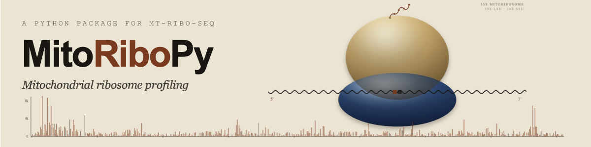

<p align="center">
  
</p>

# MitoRiboPy

Mitochondrial ribosome profiling (mt-Ribo-seq) analysis, end to end.

MitoRiboPy is a Python package + CLI for analysing mt-Ribo-seq data from raw FASTQ all the way through translation-efficiency integration with paired RNA-seq. Every per-sample decision (kit, dedup, offsets) is independent, so mixed-library batches just work.

The package is built around four pipeline subcommands plus six utilities. Pass `--help` on any of them for the full flag list, or see [docs/reference/cli.md](docs/reference/cli.md).

| Subcommand | What it does | Typical use |
|---|---|---|
| `mitoribopy align` | FASTQ → BAM → BED6 (cutadapt + bowtie2 + umi_tools + pysam) | "I only want trimming + alignment" |
| `mitoribopy rpf` | BED/BAM → offsets, translation profile, codon usage, coverage plots, metagene Fourier QC | "I already have aligned BEDs" |
| `mitoribopy rnaseq` | Translation efficiency from paired RNA-seq + Ribo-seq. `--rna-fastq` runs trimming → bowtie2 → counting → pyDESeq2 → TE/ΔTE end-to-end (needs `pip install 'mitoribopy[fastq]'`); `--de-table` accepts an external DE table + a prior rpf run (SHA256-gated). | "TE / ΔTE" |
| `mitoribopy all` | End-to-end orchestrator (align + rpf + optional rnaseq from one YAML); writes a composed `run_manifest.json`. `--resume` is hash-validated against the prior manifest. | "I have raw FASTQ and want everything" |
| `mitoribopy validate-config` | Parse + canonicalise + check paths + validate `rnaseq.mode`. Exit 0 / 2. | Before long cluster jobs |
| `mitoribopy validate-reference` | Pre-flight a custom mt-transcriptome FASTA + annotation pair. Exit 0 / 2. | Custom organisms |
| `mitoribopy validate-figures` | Mechanically QC every plot under a finished run; writes `figure_qc.tsv`. Exit 0 / 1 / 2 (`--strict` upgrades warn → fail). | After a run |
| `mitoribopy periodicity` | Standalone metagene Fourier QC on a saved site table. | Re-tune Fourier window without re-running offsets |
| `mitoribopy summarize` | Regenerate `SUMMARY.md` from `run_manifest.json`. Auto-invoked by `all`. | Re-render an old run's summary |
| `mitoribopy benchmark` | Time + RSS + disk for a `mitoribopy all` invocation. `--subsample N` reservoir-samples each FASTQ. | Cluster sizing |

---

## Table of contents

1. [What MitoRiboPy is for](#what-mitoribopy-is-for)
2. [Pipeline overview](#pipeline-overview)
3. [Installation](#installation)
4. [Quick start](#quick-start)
5. [Inputs you need to prepare](#inputs-you-need-to-prepare)
   - [What each module requires](#what-each-module-requires)
   - [Sample sheet (unified per-project TSV)](#sample-sheet-unified-per-project-tsv)
   - [Input files (file-by-file reference)](#input-files-file-by-file-reference)
6. [How to run — YAML vs shell wrapper](#how-to-run--yaml-vs-shell-wrapper)
7. [Strain presets and footprint classes](#strain-presets-and-footprint-classes)
8. [Subcommand reference](#subcommand-reference)
   - [`mitoribopy align`](#mitoribopy-align)
   - [`mitoribopy rpf`](#mitoribopy-rpf)
   - [`mitoribopy rnaseq`](#mitoribopy-rnaseq)
   - [`mitoribopy all`](#mitoribopy-all)
9. [What the numbers mean — RNA, RPF, TE, ΔTE](#what-the-numbers-mean--rna-rpf-te-%CE%B4te)
   - [3-nt periodicity QC](#3-nt-periodicity-qc)
10. [Output overview](#output-overview)
11. [Custom organisms](#custom-organisms)
12. [Built-in references](#built-in-references)
13. [Examples](#examples)
14. [Tools](#tools)
15. [Logs and provenance](#logs-and-provenance)
16. [Development](#development)
17. [Citation](#citation)
18. [Known limitations](#known-limitations)
19. [License](#license)

---

## What MitoRiboPy is for

MitoRiboPy is a focused tool for the 13 mt-mRNAs of human mitochondria (or 8 mt-mRNAs in yeast, with configurable codon tables for any other mitochondrion). It ships:

- **Per-sample adapter detection** with auto-fallback to the right kit. Mixed-kit and mixed-UMI batches resolve each sample independently. Pre-trimmed FASTQs (e.g. SRA-deposited data) are auto-detected and routed through cutadapt with no `-a` flag.
- **Per-sample offset selection** so inter-sample drift in the canonical 12–15 nt 5' P-site offset doesn't bias your downstream codon-usage tables. A combined-across-samples diagnostic is still emitted and an `offset_drift_<align>.svg` plot makes drift visible at a glance.
- **Both P-site and A-site downstream outputs** by default, side by side under per-site subdirectories. No ambiguity about which output corresponds to which site.
- **End-to-end RNA-seq + Ribo-seq → TE / ΔTE in one subcommand.** `mitoribopy rnaseq` takes raw FASTQs and a transcriptome FASTA and runs trimming, bowtie2 alignment, per-transcript counting, and pyDESeq2 itself before emitting TE, ΔTE, and a six-figure plot set. (Bringing your own pre-computed DE table from R / Python remains supported via `--de-table` and enforces a SHA256 reference-consistency gate.)
- **Strain-aware defaults**: built-in human (`-s h.sapiens`) and yeast (`-s s.cerevisiae`) annotations + codon tables, plus `custom` for any other organism with a published NCBI Genetic Code (mouse, fly, plants, fungi, ...).

What MitoRiboPy is **not**:

- Not a general-purpose nuclear Ribo-seq pipeline. The defaults, references, and dedup heuristics are calibrated for the low-complexity 13-mRNA mt universe.
- Not a general DE engine for nuclear genes. The default `mitoribopy rnaseq` flow runs **pyDESeq2 on the mt-mRNA subset only**, which is fine for exploring mt-translation efficiency end-to-end on a single library. For publication-grade DE statistics across the full transcriptome run DESeq2 / Xtail / Anota2Seq externally and pass the resulting table via `--de-table`.

---

## Pipeline overview


UMI handling: the UMI is extracted into the read QNAME during the cutadapt trim step (5' single-pass or 3' two-pass), so it travels through bowtie2 alignment unchanged and is available for `umi_tools dedup` after the MAPQ filter — the only stage that needs alignment coordinates AND the UMI together.

### Detailed stage diagrams

- [docs/diagrams/02_align_stage.png](docs/diagrams/02_align_stage.png) — internals of `mitoribopy align`: per-sample resolution → cutadapt + UMI → contam subtract → bowtie2 → MAPQ → dedup → BED6.
- [docs/diagrams/03_rpf_stage.png](docs/diagrams/03_rpf_stage.png) — internals of `mitoribopy rpf`: filter BED → offset enrichment + selection → translation_profile + coverage_profile_plots + optional modules.
- [docs/diagrams/04_rnaseq_stage.png](docs/diagrams/04_rnaseq_stage.png) — internals of the optional `mitoribopy rnaseq` stage: DE table + rpf_counts → SHA256 reference gate → TE → ΔTE → scatter + volcano.

Regenerate with `python docs/diagrams/render_diagrams.py` (matplotlib only; no Node / mermaid-cli required).

---

## Installation

The README and `examples/templates/` describe the current **v0.7.0** interface. Verify with `mitoribopy --version`. See [CHANGELOG.md](CHANGELOG.md) for the consolidated v0.7.0 release notes — this is the publication-readiness release: aggregate-then-DFT metagene Fourier QC with bootstrap CI + circular-shift permutation null, per-gene unit-mean metagene aggregation by default (legacy depth-weighted sum still available behind `normalize="none"`), nulled Wald p-values in the from-FASTQ rnaseq mode, JSON Schema for `run_manifest.json`, per-(sample, transcript) strand-sanity audit, and a "Periodicity statistical confidence" table in `SUMMARY.md`.

### From source (recommended)

```bash
git clone https://github.com/Ahram-Ahn/MitoRiboPy.git
cd MitoRiboPy
git checkout v0.7.0          # current published version; omit for HEAD
python -m pip install -e .
mitoribopy --version          # MUST print 0.7.0 or later
```

This pulls every Python dependency (`numpy`, `pandas`, `matplotlib`, `seaborn`, `biopython`, `scipy`, `PyYAML`, `pysam`) automatically. The external bioinformatics tools (`cutadapt`, `bowtie2`, `umi_tools`, …) still need to be on `$PATH` separately — see [External tool dependencies](#external-tool-dependencies) below.

For development and tests, add the dev extras:

```bash
python -m pip install -e ".[dev]"
```

### From PyPI

```bash
python -m pip install 'mitoribopy>=0.7.0'
```

The package is published on PyPI: [pypi.org/project/mitoribopy](https://pypi.org/project/mitoribopy/). Pin the lower bound (`>=0.7.0`) so a stale PyPI cache cannot install a pre-publication-freeze build.

### Verify the install

```bash
mitoribopy --version
mitoribopy --help
```

If you prefer not to install at all:

```bash
PYTHONPATH=src python -m mitoribopy --help
```

### 30-second smoke test

The repo ships a tiny end-to-end fixture under [`examples/smoke/`](examples/smoke/) so a fresh install can be verified in one command. Three synthetic mt-mRNAs, two samples, no UMIs, no contaminants — designed to exercise every stage (cutadapt → bowtie2 → BED → offsets → translation profile → coverage → metagene Fourier QC) without external data:

```bash
cd examples/smoke
python generate_smoke_fastqs.py    # writes *.fastq.gz + bowtie2 index
mitoribopy all --config pipeline_config.smoke.yaml --output results/
```

Expected wall-clock: 10–30 s on a 2024 laptop. Every file in [`examples/smoke/expected_outputs.txt`](examples/smoke/expected_outputs.txt) must exist + be non-empty after the run; the same assertion runs in CI under `pytest -m smoke` when the external tools are present.

### External tool dependencies

MitoRiboPy shells out to a small set of standard bioinformatics tools. All of them must be on `$PATH` for a real run:

| Tool | Used by | Required when |
|---|---|---|
| `cutadapt` | `align`, `rnaseq` (from-FASTQ) | always (length + quality filter even for pre-trimmed data) |
| `bowtie2` + `bowtie2-build` | `align`, `rnaseq` (from-FASTQ) | always |
| `umi_tools` | `align` | at least one sample's resolved kit has UMIs |
| `pysam` (Python lib) | `align`, `rpf`, `rnaseq` (from-FASTQ) | always (installed automatically via `pip`) |
| `samtools` | optional | recommended for inspecting outputs; not required |
| `pydeseq2` (Python lib) | `rnaseq` (from-FASTQ) | only when running `mitoribopy rnaseq` in from-FASTQ mode (`--rna-fastq …`); install via the `[fastq]` extra: `pip install 'mitoribopy[fastq]'`. The pre-computed-DE flow does not need it. |

The bioconda environment under [docs/environment/environment.yml](docs/environment/environment.yml) installs everything in one command:

```bash
conda env create -f docs/environment/environment.yml
conda activate mitoribopy
```

---

## Quick start

The shortest path from raw FASTQ to translation-profile + coverage outputs is one YAML file plus one command.

```bash
# 1. Start from one of two templates next to your data and fill in the paths:
#    -- examples/templates/ ships an EXHAUSTIVE template that lists every
#       available flag with its default value and a 1-line comment:
cp examples/templates/pipeline_config.example.yaml pipeline_config.yaml
#    -- OR get the curated MINIMAL template from the CLI:
mitoribopy all --print-config-template > pipeline_config.yaml

$EDITOR pipeline_config.yaml

# 2. Optional: dry-run prints the per-stage argv so you can review.
mitoribopy all --config pipeline_config.yaml --output results/ --dry-run

# 3. Run.
mitoribopy all --config pipeline_config.yaml --output results/
```

The matching shell-script templates are at [examples/templates/run_align.example.sh](examples/templates/run_align.example.sh), [examples/templates/run_rpf.example.sh](examples/templates/run_rpf.example.sh), and [examples/templates/run_pipeline.example.sh](examples/templates/run_pipeline.example.sh) — pick those if you prefer per-stage commands you can split across cluster jobs.

### Publication-safe recipe

Use this recipe for any run that backs a manuscript, preprint, or shared dataset. **One switch — `mitoribopy all --strict` — turns on every publication-readiness gate** (config preflight, align strict-publication-mode, post-run figure QC, warning promotion). Each step also leaves a self-auditing artifact you can drop into a methods section.

```bash
# 0. Pin the manuscript version
python -m pip install 'mitoribopy>=0.7.0'
mitoribopy --version

# 1. Optional pre-flights (also run automatically by --strict below)
mitoribopy validate-config pipeline_config.yaml --strict
mitoribopy validate-reference \
    --fasta references/human_mt_transcriptome.fa \
    --strain h.sapiens

# 2. Dry-run to inspect the per-stage commands the orchestrator will issue
mitoribopy all --config pipeline_config.yaml --output results/full_run --dry-run

# 3. Run, publication-safe, with structured progress events for audit logs
mitoribopy all \
    --config pipeline_config.yaml \
    --output results/full_run \
    --strict \
    --progress jsonl \
    --progress-file results/full_run/progress.jsonl
```

That single `--strict` invocation:

* runs `validate-config --strict` up-front and aborts before any stage if a deprecated key, unknown key, or missing input is found,
* forwards `--strict-publication-mode` into the align stage so non-default policies that would invalidate a publication run fail-fast,
* writes `<output>/canonical_config.yaml` (the fully-resolved config the run actually executed — auto-wiring + sample-sheet expansion + rnaseq-mode resolution applied) so a reviewer can diff it against your input config,
* runs `validate-figures --strict` after the pipeline finishes, promoting warn-only QC findings to fail in `figure_qc.tsv`,
* still emits `SUMMARY.md`, `outputs_index.tsv`, `warnings.tsv`, and `progress.jsonl` regardless of the strictness gates.

For TE / ΔTE, the publication route is `--rnaseq-mode de_table`: run a full-transcriptome DESeq2 / Xtail / Anota2Seq externally and feed the table back. The in-tree from-FASTQ path runs pyDESeq2 on the **mt-mRNA subset only** and is exploratory; n=1 designs fail-fast unless you pass `--allow-pseudo-replicates-for-demo-not-publication`.

```yaml
# Publication TE route (place under `rnaseq:` in your pipeline_config.yaml).
rnaseq:
  rnaseq_mode: de_table
  de_table: external_full_transcriptome_deseq2.tsv
  reference_gtf: references/gencode_or_refseq.gtf   # SHA-gated against rpf
  gene_id_convention: hgnc                          # or ensembl / refseq / mt_prefixed / bare
  base_sample: WT
  compare_sample: KO
```

A minimal `pipeline_config.yaml` for a typical human mt-Ribo-seq run looks like this (annotated). **The recommended idiom is a top-level `samples:` block** — a single TSV that names every Ribo-seq and (optional) RNA-seq FASTQ once, and is auto-wired into both the align and rnaseq stages. `align.fastq:` is still accepted as a standalone shortcut for a single-stage run.

```yaml
# Top-level: unified per-project sample sheet (recommended). The same
# TSV drives both align (Ribo-seq rows) and rnaseq (RNA-seq rows). See
# `mitoribopy --help` and docs/reference/sample_sheet_schema.md for
# the column reference. Pairings between Ribo-seq and RNA-seq are by
# sample_id, never by index.
samples:
  table: samples.tsv

align:
  # Per-sample auto detection; an explicit kit_preset is the fallback
  # when the per-sample column is empty.
  kit_preset: auto                # auto | illumina_smallrna | illumina_truseq |
                                  # illumina_truseq_umi | qiaseq_mirna |
                                  # pretrimmed | custom
  adapter_detection: auto         # auto | off | strict
  library_strandedness: forward
  contam_index: input_data/indexes/rrna_contam
  mt_index: input_data/indexes/mt_tx
  mapq: 10
  min_length: 15
  max_length: 45
  dedup_strategy: auto            # umi-tools per sample if UMI, else skip

rpf:
  strain: h.sapiens               # human mt-mRNA reference + codon table
  fasta: input_data/human-mt-mRNA.fasta
  footprint_class: monosome       # short | monosome | disome | custom
                                  # monosome's biological default window:
                                  #   h.sapiens 28-34 nt; s.cerevisiae 37-41 nt
  # rpf: [29, 34]                 # USER OVERRIDE — only if read-length QC
                                  # confirms a tighter window carries the
                                  # periodic signal. Omit to use the
                                  # footprint_class default.
  align: stop                     # anchor offsets at the stop codon
  offset_type: "5"                # offsets reported from the read 5' end
  offset_site: p                  # coordinate space of the SELECTED OFFSETS
                                  # table (controls offset_applied.csv only)
  offset_pick_reference: p_site
  offset_mode: per_sample         # per-sample offsets drive downstream
  analysis_sites: both            # which downstream P-site/A-site outputs
                                  # to generate (independent of offset_site)
  min_5_offset: 10
  max_5_offset: 22
  min_3_offset: 10
  max_3_offset: 22
  offset_mask_nt: 5
  plot_format: svg
  codon_density_window: true
```

> `offset_site` controls the coordinate system of the selected-offset table. `analysis_sites` controls which downstream P-site / A-site outputs are produced. They are independent — for example, you can pick offsets in P-site space and still emit both P-site and A-site coverage profiles.

After the run, you'll have:

```text
results/
  align/    bed/, kit_resolution.tsv, read_counts.tsv, run_settings.json
            (intermediate trimmed/contam_filtered/aligned files are deleted as
             soon as they are consumed; pass --keep-intermediates to retain
             them; deduped/ is only created for UMI samples)
  rpf/      offset_diagnostics/{csv,plots}/, translation_profile/<sample>/...,
            coverage_profile_plots/{read_coverage_*, {p_site,a_site}_density_*},
            codon_correlation/{p_site,a_site}/, igv_tracks/<sample>/, rpf_counts.tsv
  run_manifest.json
```

See [Output overview](#output-overview) for the full directory tree.

---

## Inputs you need to prepare

This section answers "what do I need on disk before I run anything?". Read [What each module requires](#what-each-module-requires) first to scope your prep work, then see [Sample sheet](#sample-sheet-unified-per-project-tsv) for the recommended single-source-of-truth file format, and [Input files](#input-files-file-by-file-reference) for per-file specifics.

### What each module requires

Each subcommand in the pipeline consumes its own slice of the inputs below. **Required** rows must be present or the run aborts. **Optional** rows have sensible defaults but commonly need overriding.

#### `mitoribopy align` — RNase-trimmed FASTQs → BED + read counts

| Kind | Item | Required? | Notes |
|---|---|---|---|
| File | Ribo-seq FASTQs (`*.fq[.gz]` / `*.fastq[.gz]`) | **required** | Provide via `--fastq <files>` (repeatable) or `--fastq-dir <dir>`. |
| File | mt-transcriptome bowtie2 index prefix | **required** | Built once with `bowtie2-build`. Pass via `--mt-index <prefix>`. |
| File | rRNA / tRNA contaminant bowtie2 index prefix | **required** | Used to subtract contaminants. Pass via `--contam-index <prefix>`. |
| File | **Sample sheet** (`samples.tsv`) | optional | One row per Ribo-seq FASTQ; documents per-sample kit / UMI / strandedness. Strongly recommended for mixed-kit batches. See [Sample sheet](#sample-sheet-unified-per-project-tsv). |
| Option | `--kit-preset` | optional (`auto` default) | Library-prep kit; `auto` detects per FASTQ. Override per sample in the sample sheet. |
| Option | `--library-strandedness {forward,reverse,unstranded}` | optional (`forward` default) | dUTP-stranded libraries should set `reverse`. |

#### `mitoribopy rpf` — BED + reference FASTA → P-site / A-site analysis

| Kind | Item | Required? | Notes |
|---|---|---|---|
| File | Ribo-seq BEDs (or BAMs) | **required** | When run after `align`, auto-wired from `<align>/bed/`. Standalone runs use `--directory <dir>`. |
| File | mt-transcriptome FASTA | **required** | One record per mt-mRNA. Pass via `--fasta <path>`. |
| File | Annotation CSV | optional (built-in for h.sapiens / s.cerevisiae) | Required only for custom organisms. See [Custom organisms](#custom-organisms) for the full schema. |
| File | Codon-table JSON | optional (NCBI codes 1–33 bundled) | Pick one via `--codon_table_name`; supply your own only for non-NCBI codes. |
| File | Read-count table (`read_counts.tsv`) | optional (RPM normalization) | Auto-wired from `align/read_counts.tsv` when run via `mitoribopy all`. |
| Option | `-rpf <min> <max>` | optional (footprint-class default) | Read-length window. Defaults: monosome 28–34 (human), 37–41 (yeast). |
| Option | `--strain {h.sapiens, s.cerevisiae, custom}` | **required** | Drives the built-in annotation + codon table; `custom` requires the two files above. |

#### `mitoribopy rnaseq` — TE / ΔTE from RNA-seq + Ribo-seq (two flows)

**Default flow (from raw FASTQ):**

| Kind | Item | Required? | Notes |
|---|---|---|---|
| File | RNA-seq FASTQs | **required** | Via `--rna-fastq <files/dirs>` OR derived from a sample sheet. |
| File | Ribo-seq FASTQs | optional | Via `--ribo-fastq` OR sample sheet. When omitted the run short-circuits after writing the RNA DE table. |
| File | Transcriptome FASTA | **required** | Via `--reference-fasta <path>`. SHA256 recorded in the manifest. |
| File | Sample sheet OR condition map | **required (one of)** | `--sample-sheet samples.tsv` (recommended) **OR** `--condition-map conditions.tsv` (legacy two-column form). Pairs RNA and Ribo by `sample_id`, never by index. |
| Option | `--gene-id-convention {ensembl,refseq,hgnc,mt_prefixed,bare}` | **required** | Identifier scheme used in the FASTA / DE table. No default. |
| Option | `--base-sample` / `--compare-sample` | **required** | Reference vs comparison condition for the contrast (also accepted as `--condition-a` / `--condition-b`). |
| Option | `--allow-pseudo-replicates-for-demo-not-publication` | opt-in | Required to proceed when any condition has only 1 sample (publication-safe default is to fail-fast). |

**Alternative flow (bring your own DE table):**

| Kind | Item | Required? | Notes |
|---|---|---|---|
| File | DE results table (DESeq2 / Xtail / Anota2Seq) | **required** | Via `--de-table <path>`. CSV or TSV. |
| File | Prior `mitoribopy rpf` output dir | **required** | Via `--ribo-dir <dir>`. Must contain `rpf_counts.tsv` + `run_settings.json` with `reference_checksum`. |
| File | Reference FASTA / GTF | **required (one of)** | Via `--reference-gtf <path>` (gets hashed) **or** `--reference-checksum <sha256>` (when the file is not on this host). |
| File | Condition map | optional | Enables a replicate-based Ribo log2FC for ΔTE; without it, ΔTE rows carry only the mRNA log2FC. |

#### `mitoribopy all` — end-to-end orchestrator

`mitoribopy all` runs the three stages above with one shared YAML config. Required inputs are the **union** of every active stage's required inputs. The config has these top-level sections:

| Section | When to include | Notes |
|---|---|---|
| `samples:` | recommended | Top-level `samples: { table: samples.tsv }` is the canonical declaration of every input FASTQ + per-sample metadata. Auto-wires both `align` and `rnaseq`. See [Sample sheet](#sample-sheet-unified-per-project-tsv). |
| `align:` | required for align | Indexes, kit / strandedness, dedup. Omit `align.fastq` when `samples:` is set — the sheet supplies it. |
| `rpf:` | required for rpf | Strain, RPF window, FASTA, offset bounds. Auto-wires `--directory`, `--read_counts_file`, `--fasta`. |
| `rnaseq:` | required for rnaseq | Either flow's keys (the two are mutually exclusive). The sheet auto-wires `rnaseq.sample_sheet` so you do not repeat it. |

Use `mitoribopy all --print-config-template > pipeline_config.yaml` to drop a fully-commented starter into your project.

### Sample sheet (unified per-project TSV)

A single TSV declares every sample once, replacing the old pair of stage-specific tables (`--sample-overrides` and `--condition-map`). It is **the recommended way** to declare inputs for any non-trivial project: pairings between Ribo-seq and RNA-seq are by `sample_id` (never by index), per-sample kit / UMI overrides for mixed batches live in the same file, and an `exclude` column lets you drop a bad library without deleting rows.

**Required columns:** `sample_id`, `assay` (`ribo` or `rna`), `condition`, `fastq_1`.
**Optional columns:** `replicate`, `fastq_2`, `kit_preset`, `adapter`, `umi_length`, `umi_position` (`5p` / `3p` / `both`), `umi_length_5p`, `umi_length_3p` (per-end lengths for `umi_position=both`), `strandedness`, `dedup_strategy`, `exclude` (`true`/`false`/blank), `notes`.

Empty cells (`""`, `NA`, `None`, `-`, `null`) read as "use the default". Lines starting with `#` and blank lines are ignored. Validation is strict: a single load pass reports every row error so you can fix the sheet without iterate-and-retry.

```tsv
sample_id	assay	condition	replicate	fastq_1	fastq_2	kit_preset	umi_length	umi_position	strandedness	exclude	notes
WT_Ribo_1	ribo	WT	1	fastq/WT_Ribo_1.fq.gz		illumina_truseq_umi	8	5p	forward	false	
WT_Ribo_2	ribo	WT	2	fastq/WT_Ribo_2.fq.gz		illumina_truseq_umi	8	5p	forward	false	
KO_Ribo_1	ribo	KO	1	fastq/KO_Ribo_1.fq.gz		illumina_truseq_umi	8	5p	forward	false	
KO_Ribo_2	ribo	KO	2	fastq/KO_Ribo_2.fq.gz		illumina_truseq_umi	8	5p	forward	true	contaminated lane
WT_RNA_1	rna	WT	1	fastq/WT_RNA_1_R1.fq.gz	fastq/WT_RNA_1_R2.fq.gz	pretrimmed	0	5p	forward	false	
KO_RNA_1	rna	KO	1	fastq/KO_RNA_1_R1.fq.gz	fastq/KO_RNA_1_R2.fq.gz	pretrimmed	0	5p	forward	false	
```

How it threads through the pipeline:

| Stage | What the sheet supplies |
|---|---|
| `mitoribopy align` | The Ribo-seq FASTQ list (`assay='ribo'` rows, `exclude=false`) and a materialised `sample_overrides.tsv` carrying the per-sample kit / UMI / dedup columns. |
| `mitoribopy rnaseq` | The RNA-seq FASTQ list (`assay='rna'`), the Ribo-seq FASTQ list (re-counted from raw FASTQ in this stage's own align machinery), and the `sample_id → condition` mapping that drives the pyDESeq2 contrast. |
| `mitoribopy all` | Both of the above, auto-wired. Top-level `samples: { table: samples.tsv }` (or shorthand `samples: samples.tsv`) is the only place you need to declare inputs. |

Mutual-exclusion rules: when the sheet is set, declaring `align.fastq` / `align.fastq_dir` / `align.samples` / `align.sample_overrides` / `rnaseq.rna_fastq` / `rnaseq.ribo_fastq` / `rnaseq.condition_map` alongside it is an error — pick one input style per stage.

### Input files (file-by-file reference)

### FASTQ (primary input to `align`)

Accepted file extensions: `*.fq`, `*.fq.gz`, `*.fastq`, `*.fastq.gz`. Both gzipped and uncompressed are auto-detected.

Two ways to point the pipeline at your FASTQs:

1. **Directory** (recommended): pass a directory containing every input FASTQ.
   - CLI: `--fastq-dir input_data/`
   - YAML: `align.fastq: input_data/` (a single string is treated as a directory)
2. **Explicit list**: name each FASTQ.
   - CLI: `--fastq sampleA.fq.gz --fastq sampleB.fq.gz` (repeatable)
   - YAML: `align.fastq: [sampleA.fq.gz, sampleB.fq.gz]` (a list is treated as explicit paths)

Sample names are derived from the FASTQ filename with the extension stripped (`WT_R1.fq.gz` → `WT_R1`). The same name flows through every per-sample table (`read_counts.tsv`, `kit_resolution.tsv`, downstream profile and codon usage subdirs).

### BED (input to `rpf` if you already have aligned BEDs)

Expected columns:

1. `chrom`
2. `start`
3. `end`

Additional BED columns are tolerated. Coordinates are 0-based, end-exclusive intervals (standard BED).

When the `align` stage runs first (or you use `mitoribopy all`), `mitoribopy rpf` consumes `<align>/bed/` automatically — you never need to handle BED files by hand.

### BAM (alternative input to `rpf`)

`mitoribopy rpf --directory <dir>` accepts BAM files mixed with BED. BAMs are auto-converted to BED6 under `<output>/bam_converted/` via pysam. The `--bam_mapq` flag (default 10) filters BAM reads on MAPQ before conversion to suppress NUMT cross-talk; set to 0 to disable.

### Reference FASTA

One FASTA record per mt-mRNA. Headers must match the `sequence_name` column of the annotation CSV (or any of its `sequence_aliases`). The built-in human and yeast annotations cover the canonical mt-mRNAs and ship under `src/mitoribopy/data/`.

For total-genome FASTAs (rare in mt-Ribo-seq), use `--annotation_file` to map FASTA records onto your own annotation rows.

### Annotation CSV (custom organisms)

Built-in `h.sapiens` and `s.cerevisiae` ship complete annotation tables and need nothing here. For any other organism, supply a per-transcript CSV via `--annotation_file`. The full schema (required vs optional columns, defaults, and a worked example) lives in [Custom organisms](#custom-organisms).

### Codon-table JSON (custom organisms)

The 27 NCBI Genetic Codes are bundled. Pick one with `--codon_table_name` (full picker in [Custom organisms](#custom-organisms)). Supply your own `--codon_tables_file` only when your organism's code is not in the NCBI list.

### Read-count table (optional, for RPM normalization)

`.csv`, `.tsv`, and `.txt` accepted; delimiter is auto-detected. Column matching is flexible and case-insensitive, with positional fallback:

- column 1: sample name
- column 2: reference (used when `--rpm_norm_mode mt_mrna`)
- column 3: read count

When `mitoribopy all` runs `align` first, the read-count table is auto-wired from `<run_root>/align/read_counts.tsv`.

---

## How to run — YAML vs shell wrapper

### Recommended: YAML config

```bash
mitoribopy all --config pipeline_config.yaml --output results/ --threads 8
```

This is the canonical invocation. The YAML is self-documenting, version-controllable, and loads exactly the same way the CLI reads it programmatically.

For multi-sample batches, add `max_parallel_samples: N` under the `align:` section of your YAML to align samples concurrently — `--threads` is auto-divided across workers so total CPU use stays ≈ `--threads`. (`mitoribopy all` does not take `--max-parallel-samples` directly at the CLI; the flag is read from the YAML and forwarded to the align stage. The standalone `mitoribopy align` subcommand does accept it on the CLI — see [Example B](#b-just-the-align-stage-on-a-directory-of-fastqs) below.) The joint `rpf` stage stays serial (offset selection is a pooled-across-samples computation). See [Execution / concurrency](#execution--concurrency) under the `mitoribopy align` reference.

### Alternative: bash wrapper for batch / cluster jobs

When every flag should be visible in the job script (e.g. for a cluster scheduler that captures stdout/stderr per task), wrap the YAML invocation in a thin shell wrapper:

```bash
#!/usr/bin/env bash
set -uo pipefail

ENV_BIN=/path/to/conda/envs/mitoribopy/bin
export PATH="$ENV_BIN:$PATH"

ROOT=/path/to/project
cd "$ROOT"

OUT=results/full_run
mkdir -p "$OUT"

mitoribopy all \
  --config pipeline_config.yaml \
  --output "$OUT" \
  --threads 8
RC=$?

echo
echo "================ kit_resolution.tsv ================"
cat "$OUT/align/kit_resolution.tsv"
echo
echo "================ read_counts.tsv ================"
cat "$OUT/align/read_counts.tsv"

echo "$RC" > "$OUT.exitcode"
exit $RC
```

### Direct subcommand invocation

You can run any single stage directly without going through `mitoribopy all`. This is useful when you only have BED inputs (skip `align`), or when you want to iterate on `rpf` parameters without re-running alignment.

```bash
# Just align
mitoribopy align --kit-preset auto --fastq-dir fastqs/ \
  --contam-index idx/rrna --mt-index idx/mt --output results/align/

# Just rpf, against an existing BED dir
mitoribopy rpf -s h -f ref.fa --directory bed/ -rpf 29 34 --output results/rpf/

# Just rnaseq (default flow): raw FASTQ -> pyDESeq2 -> TE / dTE
mitoribopy rnaseq --rna-fastq rna_seq/ --ribo-fastq ribo_seq/ \
  --reference-fasta ref.fa --gene-id-convention bare \
  --condition-map samples.tsv \
  --base-sample control --compare-sample knockdown \
  --output results/rnaseq/

# `--base-sample` / `--compare-sample` are aliases for `--condition-a` /
# `--condition-b`; pick whichever spelling you prefer (the legacy form
# still works). The base condition is the reference (denominator) of
# the WT-vs-X contrast and seeds the labels on every comparison plot.

# Or rnaseq (alternative flow): existing rpf output + an external DE table
mitoribopy rnaseq --de-table de.tsv --gene-id-convention hgnc \
  --ribo-dir results/rpf --reference-gtf ref.fa --output results/rnaseq/
```

---

## Strain presets and footprint classes

### Strain (`-s` / `--strain`)

The strain preset selects the organism's mitochondrial annotation and codon table. Two organisms ship complete reference data; everything else uses `custom` and supplies its own files (see [Custom organisms](#custom-organisms)).

| Value | Organism | Codon table | Ships annotation? | Ships `-rpf` default? |
|---|---|---|:-:|:-:|
| `h.sapiens` (default) | *Homo sapiens* mt | `vertebrate_mitochondrial` (NCBI #2) | ✓ | ✓ |
| `s.cerevisiae` | *Saccharomyces cerevisiae* mt | `yeast_mitochondrial` (NCBI #3) | ✓ | ✓ |
| `custom` | Any other organism | user-supplied via `--codon_table_name` (built-in NCBI list) or `--codon_tables_file` | ✗ — pass `--annotation_file` | ✗ — pass `-rpf MIN MAX` |

`h` and `y` are also accepted as short synonyms for `h.sapiens` and `s.cerevisiae`.

### Footprint class (`--footprint_class`)

Pair `-s` with `--footprint_class` to pick sensible RPF and unfiltered-length defaults. An explicit `-rpf MIN MAX` or `--unfiltered_read_length_range MIN MAX` always wins over the footprint-class default. Built-in defaults exist for `h.sapiens` and `s.cerevisiae`; for `--strain custom` you must also pass `-rpf`.

| Value | RPF window default | `--unfiltered_read_length_range` default | Use for |
|---|---|---|---|
| `short` | h.sapiens / s.cerevisiae: 16–24 | 10–30 | Truncated RNase products. Sit just below the canonical monosome window; useful for context-dependent pausing and as a QC indicator of digest aggressiveness. |
| `monosome` (default) | h.sapiens: 28–34, s.cerevisiae: 37–41 | 15–50 | Single-ribosome footprints. The standard mt-Ribo-seq class. |
| `disome` | h.sapiens: 50–70, s.cerevisiae: 60–90 | 40–100 | Collided-ribosome footprints. eIF5A-depletion, queueing, ribosome-stalling studies. |
| `custom` | user must pass `-rpf` | unchanged | Any non-standard footprint class. |

---

## Subcommand reference

Every subcommand inherits these shared options:

| Flag | Default | Description |
|---|---|---|
| `--config PATH` | — | Configuration file (.json, .yaml, .yml, or .toml). CLI flags override values from the file. |
| `--dry-run` | off | Print planned actions and exit 0 without executing. |
| `--threads N` | 1 | Preferred thread count; exports `OMP_NUM_THREADS`, `OPENBLAS_NUM_THREADS`, `MKL_NUM_THREADS`, `MITORIBOPY_THREADS`. When combined with `--max-parallel-samples M` (align only), each parallel worker's external tools see `max(1, N // M)` threads so the total CPU budget stays ≈ N. |
| `--log-level {DEBUG,INFO,WARNING,ERROR}` | `INFO` | Python logging level for console output. |

---

### `mitoribopy align`

FASTQ → BAM → BED6 per sample: adapter detection → cutadapt → bowtie2 (contam → mt-transcriptome) → MAPQ filter → dedup → BED6.

**Required**: `--contam-index`, `--mt-index`, `--output`, plus FASTQ inputs (`--fastq-dir DIR` or repeated `--fastq PATH`). See `mitoribopy align --help` or [docs/reference/cli.md](docs/reference/cli.md) for the full flag list.

**Kit presets** (`--kit-preset`): `auto` (per-sample detection, default), `pretrimmed` (skip `-a`), `illumina_smallrna`, `illumina_truseq`, `illumina_truseq_umi` (8 nt 5' UMI), `qiaseq_mirna` (12 nt 3' UMI), `custom` (`--adapter SEQ` required). Dual-end UMI libraries (xGen Duplex, Twist) use `custom` with `--umi-position both` plus `--umi-length-5p` / `--umi-length-3p`. The per-sample resolved kit is written to `<output>/kit_resolution.tsv`.

**Adapter detection** (`--adapter-detection`): `auto` (scan + per-sample fallback to your `--kit-preset` or `pretrimmed`), `strict` (hard-fail on disagreement), `off` (trust `--kit-preset`).

**Dedup** (`--dedup-strategy`): `auto` (default; `umi-tools` for UMI samples, `skip` otherwise) | `umi-tools` | `skip`. Coordinate-only dedup (picard MarkDuplicates) was removed in v0.4.5 — it destroys codon-occupancy signal on low-complexity mt libraries (see [docs/validation/taco1_ko_regression.md](docs/validation/taco1_ko_regression.md)).

**Concurrency**: `--max-parallel-samples N` aligns N samples concurrently; with `--threads T` each worker's external tools get `max(1, T // N)` threads, keeping total CPU ≈ T. Sizing rule of thumb: `N ≤ T / 2` so every worker still gets ≥ 2 threads.

---

### `mitoribopy rpf`

Runs the Ribo-seq analysis against a directory of BED (or BAM) files: filter BED on the RPF length window → offset enrichment → per-sample offset selection → translation profile → coverage plots → metagene Fourier QC. `mitoribopy rpf --help` lists every flag; what follows is the publication-grade highlights.

**Required**: `-f FASTA`, `-d BED_DIR`, `-o OUTPUT_DIR`. `-s {h.sapiens,s.cerevisiae,custom}` (default `h.sapiens`); `--footprint_class {monosome,disome,custom}` picks `-rpf MIN MAX` defaults (h.sapiens monosome → 28-34). `--strain custom` requires `--annotation_file` and `-rpf MIN MAX`.

**Offset enrichment + selection**: `-a {start,stop}` anchor, `-r RANGE`. End-specific bounds `--min_5_offset`, `--max_5_offset`, `--min_3_offset`, `--max_3_offset` are preferred over the shared `--min_offset` / `--max_offset`. `--offset_mode {per_sample,combined}` defaults to `per_sample`; switch to `combined` only when individual samples have very low coverage. `--analysis_sites {p,a,both}` controls which downstream sites are generated (default `both` = parallel P-site + A-site outputs).

**Read-count normalization**: `--rpm_norm_mode {total,mt_mrna}` (`mt_mrna` for mt-only RPM); `--read_counts_file` is auto-wired from `align/read_counts.tsv` when running through `mitoribopy all`.

**Optional modules**: `--cor_plot` (codon correlation, requires `--base_sample NAME`), `--igv_export` (per-sample BedGraph tracks for IGV), `--structure_density` (log2/scaled density export).

**Coverage-profile outputs** under `coverage_profile_plots/`:
- `read_coverage_*` — full-footprint depth across each transcript; `_rpm` / `_raw` variants, optional `_codon`-binned across the CDS.
- `{p_site,a_site}_density_*` — single-nt density at the chosen site, with `_frame` (3-frame overlay) and `_frame_split` (3 stacked sub-rows) variants. Frame-0 dominance (~70-90 % of CDS density on frame 0) is the canonical mt-Ribo-seq QC signature.

**Periodicity QC** under `qc/`: see [3-nt periodicity QC](#3-nt-periodicity-qc) and [docs/reference/periodicity.md](docs/reference/periodicity.md).

**Synonyms** (emit a one-line deprecation notice, then keep working): `-s h` → `h.sapiens`, `-s y` → `s.cerevisiae`, `--merge_density` → `--codon_density_window`, `--mrna_ref_patterns` → `--mt_mrna_substring_patterns`, `--offset_pick_reference selected_site` → `reported_site`.

---

### `mitoribopy rnaseq`

Two mutually exclusive flows (passing both `--rna-fastq` and `--de-table` exits 2):

- **Default — from raw FASTQ** (`--rna-fastq` + `--ribo-fastq` + `--reference-fasta`): SE/PE auto-detection, adapter auto-detection, cutadapt + bowtie2, per-transcript counting, pyDESeq2 fit, then TE / ΔTE / plots. Conditions with n=1 fail fast (publication-safe); pass `--allow-pseudo-replicates-for-demo-not-publication` to opt into a tutorial-only fallback that stamps `pseudo_replicate_mode: true` and writes an `EXPLORATORY.md` sidecar. Requires `pip install 'mitoribopy[fastq]'`.
- **Alternative — bring your own DE table** (`--de-table` + `--ribo-dir`): publication-grade route. Run DE on the full transcriptome externally (DESeq2 / Xtail / Anota2Seq) and feed it here. Enforces a SHA256 reference-consistency gate against the rpf run's manifest.

Both flows always emit `te.tsv`, `delta_te.tsv`, and 6 publication-grade plots (`mrna_vs_rpf`, `delta_te_volcano`, `ma`, `de_volcano_mrna`, `te_bar_by_condition`, `te_heatmap`) at 300 dpi PNG + editable-text SVG. With `--condition-map` + `--base-sample` + `--compare-sample`, two more plots emit (`te_compare_scatter`, `te_log2fc_bar`). The default flow additionally writes `sample_pca` and `de_volcano_rpf`.

**Required flags**: `--gene-id-convention {ensembl,refseq,hgnc,mt_prefixed,bare}` — mismatches silently produce zero-match runs. Default-flow runs also need `--condition-map`, `--base-sample`, `--compare-sample`. See `mitoribopy rnaseq --help` for the complete flag list including DE-table column overrides (`--de-format`, `--de-gene-col`, etc.) and reference-consistency knobs.

---

### `mitoribopy all`

End-to-end orchestrator: align + rpf + (optional) rnaseq. Reads one YAML/JSON/TOML config and dispatches to the per-stage subcommands; writes a composed `run_manifest.json` covering every parameter, tool version, and reference checksum.

**Required**: `--config PATH`, `--output DIR`. Useful flags: `--resume` (hash-validated against the prior `run_manifest.json` — config / sample sheet / FASTA edits force the affected stage(s) to re-run), `--skip-align` / `--skip-rpf` / `--skip-rnaseq`, `--print-config-template` (commented YAML template), `--print-canonical-config` (preview the fully-wired config that would actually run), `--show-stage-help STAGE`.

**Auto-wiring**: when stages run together, `mitoribopy all` chains `rpf.directory` ← `<run_root>/align/bed`, `rpf.read_counts_file` ← `<run_root>/align/read_counts.tsv`, and `rnaseq.ribo_dir` ← `<run_root>/rpf`. Each stage's own `--output` defaults to `<run_root>/<stage>/`.

**YAML config shape**: every key under a section maps to that subcommand's CLI flag, hyphens converted to underscores. `align:` and `rnaseq:` use hyphen style (`--kit-preset` → `kit_preset`); `rpf:` uses underscore style (`--offset_type` → `offset_type`). Booleans emit the bare flag (`true`) or are omitted (`false`); `null` is dropped.

---

## What the numbers mean — RNA, RPF, TE, ΔTE

Translation efficiency is one of the most-asked-for and most-misread quantities in Ribo-seq. This section pins each quantity to a specific output file and a specific equation so reviewers don't have to guess what `te.tsv` means versus a coverage-ratio plot.

### The four quantities

| # | Quantity | Definition | What it is NOT |
|---|---|---|---|
| 1 | **RNA abundance** | Per-sample, per-transcript RNA-seq counts (or a normalised abundance estimate downstream of pyDESeq2). | Not a coverage profile, not a Ribo-seq quantity. |
| 2 | **RPF abundance** | Per-sample, per-transcript ribosome footprint counts after offset-aware filtering. | Not raw aligned-read counts (the read-length auto-filter prunes noise bins) and not a per-position density. |
| 3 | **TE (translation efficiency)** | Per-sample, per-gene RPF abundance normalised by RNA abundance. See equation below. | Not an inferential statistic — TE is a point estimate per (sample, gene). |
| 4 | **ΔTE (delta-TE)** | Per-gene log2 change in TE between two conditions. See equation below. | Not the ratio of two TEs computed sample-by-sample; it is a contrast on the log scale. |

### TE equation (`te.tsv`)

For sample *s* and gene *g*:

```
TE(s, g) = (RPF_count(s, g) + δ) / (mRNA_abundance(g) + δ)
```

where δ is the package's pseudocount (default 0.5; see [`src/mitoribopy/rnaseq/te.py`](MitoRiboPy-refactor/src/mitoribopy/rnaseq/te.py)). The pseudocount goes on **both** numerator and denominator to avoid div-by-zero and log(0). Per-gene mRNA abundance is the DE table's `baseMean` column (DESeq2 / Xtail / Anota2Seq) or a pyDESeq2-derived estimate in the from-FASTQ flow. Genes missing from the DE table are skipped — TE is undefined without an mRNA denominator.

Output: `<output>/rnaseq/te.tsv` with columns `sample, gene, rpf_count, mrna_abundance, te`. One row per (sample, gene) that has both an RPF count and a mRNA abundance.

### ΔTE equation (`delta_te.tsv`)

For gene *g*, comparing condition *B* to condition *A* (with *A* = `--base-sample` / `--condition-a`):

```
ΔTE_log2(g) = log2(RPF_FC) - log2(mRNA_FC)

         where  RPF_FC  = mean(RPF_B) / mean(RPF_A)   (with pseudocount on each mean)
                mRNA_FC = exp2(mRNA_log2fc(g))         (from the DE table)
```

ΔTE is **not** computed as `TE(B) / TE(A)` per sample. It is a contrast on log-fold-changes: each side's denominator (RNA abundance) and numerator (RPF abundance) are aggregated separately before the ratio. This is the standard formulation used by Xtail, Anota2Seq, and downstream summary statistics, and it is what removes the spurious sample-level pseudocount asymmetry you'd get from a per-sample TE ratio.

Output: `<output>/rnaseq/delta_te.tsv` with columns `gene, mrna_log2fc, rpf_log2fc, delta_te_log2, padj, note`. The `note` column carries any qualifier MitoRiboPy attached to the row:

| `note` value | Meaning |
|---|---|
| `""` (empty) | Both RPF and mRNA log2FC available; ΔTE is computed from replicate-based means. |
| `single_replicate_no_statistics` | No condition map / contrast was supplied (or only one replicate per condition); ΔTE row carries only the mRNA log2FC and `rpf_log2fc=None`. |
| `insufficient_ribo_replicates` | Condition map present but the gene has zero Ribo counts in one of the two conditions; `rpf_log2fc=None` and ΔTE is `None`. |
| `missing_from_de_table` | Gene is in the Ribo counts but absent from the DE table; everything except `gene` is `None`. |

### What is NOT in te.tsv / delta_te.tsv

These two files are **gene-level summary tables**. If you want any of the following, look elsewhere:

| You want | Look at |
|---|---|
| Per-position P-site / A-site density | `<output>/translation_profile/<sample>/footprint_density/<transcript>_footprint_density.csv` |
| Per-codon usage by sample | `<output>/translation_profile/<sample>/codon_usage/` |
| Periodicity / 3-nt phasing diagnostic | `<output>/rpf/qc/qc_summary.tsv` + `qc_summary.md` (one row / one block per sample with the overall `good/warn/poor/low_depth` call), `frame_counts_by_sample_length.tsv` (per-(sample, length) frame fractions + `expected_frame_enrichment` + `entropy_bias` + `qc_call`), `gene_periodicity.tsv` (per-(sample, gene) frame fractions + optional `phase_score` + `is_overlap_pair` flag for fused mt-mRNA pairs), and `periodicity_metagene.png` (start- and stop-aligned). Legacy `frame_summary.tsv` is still emitted alongside. |
| The descriptive coverage-normalised RPF metric (the legacy "rna-seq ratio" the v0.2.x module emitted) | **Removed in this refactor.** Use `te.tsv` for sample-level TE, or compute your own ratio from the per-position density CSVs above. |

### Pseudo-replicate runs

When a from-FASTQ flow run is launched with `--allow-pseudo-replicates-for-demo-not-publication`, both `te.tsv` and `delta_te.tsv` are still written, but `run_settings.json` carries `pseudo_replicate_mode: true` and an `EXPLORATORY.md` sidecar lists every column you should NOT cite (padj, "significant" markers, dispersion estimates). The TE and ΔTE point estimates remain readable as exploratory; only the inferential statistics are unsafe.

### 3-nt periodicity QC

The bundle under `<output>/rpf/qc/` runs an aggregate-then-DFT metagene Fourier analysis: per-gene tracks are unit-mean-normalised, mean-centred, and Hann-windowed, then averaged into a single metagene before a direct DFT is evaluated at exactly period 3.0. The legacy frame-fraction QC bundle (`qc_summary.tsv`, `frame_counts_*.tsv`, `gene_periodicity.tsv`, frame heatmaps, phase score) was retired ahead of v0.7.0 — the `spectral_ratio_3nt` + `snr_call` columns now carry the headline QC verdict, supplemented in v0.7.0 by `spectral_ratio_3nt_ci_{low,high}` (bootstrap CI over genes) and `permutation_p` (circular-shift null).

| Output | What it answers |
|---|---|
| `metagene_start.tsv` / `metagene_stop.tsv` + `metagene_{start,stop}_<site>_site.svg` | Start- and stop-anchored P-site density profiles. The community-standard "show me 3-nt phasing" sanity check, used to verify offset assignment. |
| `fourier_spectrum_combined.tsv` | Per-(sample, read_length, gene_set, region) metagene amplitude curve over period 2-10 nt. `gene_set ∈ {combined, ATP86, ND4L4}`; `region ∈ {orf_start, orf_stop}`. |
| `fourier_period3_score_combined.tsv` | Per-(sample, read_length, gene_set, region) headline 3-nt spectral ratio. Columns: `amp_at_3nt`, `background_amp_median`, `spectral_ratio_3nt`, `snr_call ∈ {excellent, healthy, modest, broken, no_signal}` (thresholds: ≥10× / ≥5× / ≥2× / <2× / NaN), `transcripts` (semicolon-joined list of contributing transcripts). |
| `fourier_spectrum/<sample>/*.png` and `*.svg` | Three figures per (sample, read_length): `*_combined.png` (canonical mt-mRNAs aggregated), `*_ATP86.png` (junction-bracketed ATP8/ATP6 bicistronic analysis: top = ATP8 frame, bottom = ATP6 frame), `*_ND4L4.png` (junction-bracketed ND4L/ND4 analysis). Each panel shows ONE aggregated trace; in-figure annotations report `spectral_ratio_3nt` and `snr_call`. |
| `periodicity.metadata.json` | Sidecar JSON recording the knobs that produced the tables: `method = metagene_dft`, `fourier_window_nt`, `drop_codons_after_start`, `drop_codons_before_stop`, `min_mean_coverage`, `min_total_counts`, `regions`, `gene_sets`. |

#### Method defaults

| Knob | Default | Where to override |
|---|---|---|
| Window width | 99 nt = 33 codons (multiple of 3) | `--periodicity-fourier-window-nt` |
| Codons skipped after AUG | 5 (15 nt — initiation peak) | `mitoribopy periodicity --drop-codons-after-start` |
| Codons skipped before stop | 1 (3 nt — termination peak) | `mitoribopy periodicity --drop-codons-before-stop` |
| Min mean coverage in window | 0.1 | `mitoribopy periodicity --min-mean-coverage` |
| Min total site counts in window | 30 | `mitoribopy periodicity --min-total-counts` |

Per-gene processing: divide by window mean → mean-centre → Hann window → element-wise mean across qualifying genes → direct DFT at exactly period 3.0 (not bin-snapped). See [docs/reference/periodicity.md](docs/reference/periodicity.md) for the math and the rationale for each step.

#### QC labels

| Label | Condition |
|---|---|
| `good` | At least one read length cleared the `good_frame_fraction` threshold AND total assigned sites ≥ `min_reads_per_length`. |
| `warn` | No length passed `good`, but at least one is between `warn_frame_fraction` and `good_frame_fraction`. |
| `poor` | No length cleared `warn_frame_fraction`. |
| `low_depth` | Every length has fewer than `min_reads_per_length` assigned sites. **Do not** infer "poor periodicity" from this — there is just not enough signal to score. |

Soft labels by design: a `poor` call does **not** automatically discard the sample. Inspect `frame_counts_by_sample_length.tsv` (a single bad read-length class can drag down a pooled call) and `gene_periodicity.tsv` (a fused overlap transcript like `ATP86` is inherently ambiguous-frame) before deciding whether to drop the sample, drop one read length, or report the periodicity as a known limitation.

#### Important caveats

- **Periodicity must be interpreted after offset assignment.** Raw read 5′ ends do not show the expected frame if length-specific offsets are not applied first.
- **Different read lengths have different optimal offsets.** Inspect read-length-specific periodicity (`frame_counts_by_sample_length.tsv`) before merging lengths for downstream analyses.
- **Human mt-ND6 is on the opposite strand** of most other human mt protein-coding genes. The transcriptome reference (Path A, the MitoRiboPy default) flips it into transcript orientation before frame assignment, so frame statistics are correct as-printed; raw genome-coordinate work must orient first.
- **Overlapping ORFs (MT-ATP8/MT-ATP6, MT-ND4L/MT-ND4)** create inherently ambiguous frame assignments in the overlap region. The bundled `input_data/human-mt-mRNA.fasta` collapses each pair into a single fused transcript (`ATP86`, `ND4L4`); both naming schemes are flagged with `is_overlap_pair=true` in `gene_periodicity.tsv`.
- **Yeast mt-mRNAs have long 5′ UTRs** with transcript-specific translation activators. Do not assume human-like leaderless initiation when scoring yeast data.

---

## Output overview

For a `mitoribopy all` run with the defaults (`--offset_mode per_sample`, `--analysis_sites both`):

```text
<output>/
  run_manifest.json                    # composed provenance: settings, tool versions,
                                       # reference_checksum, stages_run
  SUMMARY.md, summary_qc.tsv,          # auto-rendered after every run
  warnings.tsv, figure_qc.tsv,
  outputs_index.tsv

  align/
    read_counts.tsv                    # per-stage funnel (input → trim → contam → mt → MAPQ → dedup)
    kit_resolution.tsv                 # per-sample kit + UMI + dedup decisions
    run_settings.json
    aligned/<sample>.mapq.bam          # MAPQ-filtered BAMs (kept)
    deduped/<sample>.dedup.bam         # only when at least one sample uses umi-tools
    bed/<sample>.bed                   # strand-aware BED6 inputs to rpf
    trimmed/, contam_filtered/         # only --keep-intermediates

  rpf/
    rpf_counts.tsv                     # per-(sample, gene) counts; feeds rnaseq
    run_settings.json                  # includes reference_checksum
    offset_diagnostics/
      csv/                             # offset_<align>.csv (combined),
                                       # per_sample_offset/<sample>/offset_applied.csv
      plots/                           # offset_drift_<align>.svg, heatmaps, line plots
    translation_profile/<sample>/
      footprint_density/, translating_frame/, codon_usage/   # site is in the filename prefix
    coverage_profile_plots/
      read_coverage_{rpm,raw}[_codon]/         # full-footprint depth (site-independent)
      {p_site,a_site}_density_{rpm,raw}/       # single-nt density at the chosen site
      {p_site,a_site}_density_*_frame/         # frame-coloured CDS overlay (frame-0 dominance = QC)
      {p_site,a_site}_density_*_frame_split/   # 3 stacked sub-rows per sample (frame 0, +1, +2)
    qc/                                # metagene Fourier QC bundle (always emitted)
      fourier_spectrum_combined.tsv          # per-(sample, length, gene_set, region) amplitude curve
      fourier_period3_score_combined.tsv     # spectral_ratio_3nt + snr_call tier (excellent/healthy/modest/broken)
      periodicity.metadata.json
      fourier_spectrum/<sample>/<sample>_<length>nt_{combined,ATP86,ND4L4}.{png,svg}
      metagene_{start,stop}.tsv              # P-site metagene tables
      metagene_{start,stop}_p_site.svg       # 3-nt periodicity plots
      strand_sanity.tsv                      # per-sample minus-strand fraction (should be 0)
    codon_correlation/{p_site,a_site}/       # if --cor_plot
    igv_tracks/<sample>/<sample>_{p_site,a_site}.bedgraph     # if --igv_export
    structure_density/                       # if --structure_density

  rnaseq/                              # if rnaseq config supplied
    te.tsv, delta_te.tsv               # headline tables
    plots/                             # 6 always-emitted publication plots; up to 3 more
                                       # (mrna_vs_rpf, delta_te_volcano, ma, de_volcano_mrna,
                                       # te_bar_by_condition, te_heatmap, [te_compare_scatter,
                                       # te_log2fc_bar, sample_pca]) at 300 dpi PNG + editable SVG
    de_table.tsv, rpf_de_table.tsv,    # default flow only (from raw FASTQ)
    rna_counts.tsv, rpf_counts.tsv,
    rpf_counts_matrix.tsv,
    condition_map.augmented.tsv
```

### What to inspect first

After every run, walk these files in order. The first three (`SUMMARY.md`, `warnings.tsv`, `summary_qc.tsv`) catch ~90 % of gotchas without digging into per-stage TSVs.

1. **`SUMMARY.md`** — one-page human-readable view of what ran and what was produced.
2. **`warnings.tsv`** — every structured warning (`stage / sample_id / severity / code / message / suggested_action`). Header-only = nothing flagged.
3. **`summary_qc.tsv`** — per-sample QC roll-up across all stages.
4. **`align/kit_resolution.tsv`** — per-sample kit / UMI / dedup decisions; the `source` column tells you whether it was `detected`, `user_fallback`, `inferred_pretrimmed`, or set explicitly.
5. **`align/read_counts.tsv`** — per-stage drop-off; invariants `rrna_aligned + post_rrna_filter == post_trim` and `mt_aligned + unaligned_to_mt == post_rrna_filter` must hold.
6. **`rpf/offset_diagnostics/plots/offset_drift_<align>.svg`** — per-sample offset drift, visible by eye.
7. **`rpf/offset_diagnostics/csv/per_sample_offset/<sample>/offset_applied.csv`** — exact offset row applied downstream.
8. **`rpf/qc/fourier_period3_score_combined.tsv`** — metagene Fourier periodicity verdict per `(sample, read_length, gene_set, region)`. Look at `gene_set=combined` rows: `snr_call ∈ {excellent, healthy}` is publication-grade; `modest` is borderline; `broken` means offset assignment is suspect for that read length. **Read this before trusting any downstream codon-level table.**
9. **`rpf/qc/fourier_spectrum/<sample>/*.png`** — three figures per (sample, length): `combined`, `ATP86`, `ND4L4`. Each panel reports its `spectral_ratio_3nt` and `snr_call` in-figure.
10. **`rpf/coverage_profile_plots/p_site_density_rpm_frame/<transcript>_*.svg`** — frame-coloured CDS density. Frame-0 dominance (~70-90 %) is the canonical mt-Ribo-seq QC signature; flat or jittery frames suggest contamination or poor offset selection. The `_frame_split/` companion stacks each frame in its own sub-row when the overlay's tallest frame would hide low-frame signal.
11. **`rpf/rpf_counts.tsv`** + sidecar — per-(sample, gene) RPF count matrix.
12. **`rnaseq/te.tsv` + `rnaseq/delta_te.tsv`** — translation efficiency and ΔTE (when the rnaseq stage ran).
13. **`figure_qc.tsv`** (after `mitoribopy validate-figures runs/full/`) — mechanical pass/warn/fail per plot.

### Common reasons NOT to trust the output

The pipeline can finish exit-0 under several conditions that should still make a reviewer pause. Check `warnings.tsv` first; the `suggested_action` column tells you what to do.

- **Adapter detection low confidence** (`source=user_fallback` in `kit_resolution.tsv`).
- **High contaminant fraction** (>50 % of post-trim reads filtered as rRNA / contaminant).
- **Low mt-mRNA alignment fraction** (`mt_aligned / post_rrna_filter < 0.05`).
- **No clear offset peak** in `offset_*.svg` — selected offset was a fallback, not a real peak.
- **Periodicity `broken` or `no_signal`** in `fourier_period3_score_combined.tsv` — offsets did not produce codon phasing for that read length; cross-check `metagene_start_p_site.svg` for the same length.
- **Pseudo-replicate mode** — `rnaseq/EXPLORATORY.md` exists. DE statistics are exploratory only.
- **Gene-ID match rate below threshold** — `warnings.tsv` row `GENE_ID_MATCH_RATE_LOW`. DE table and rpf reference do not match.
- **`figure_qc.tsv` has any `fail` row** — overlapping labels, clipped text, or point-count mismatch.

### Publication route

1. `mitoribopy align` + `mitoribopy rpf` for RPF counts + Fourier QC.
2. Run RNA-seq DE externally on the FULL transcriptome with your tool of choice (DESeq2 / Xtail / Anota2Seq) for publication-grade statistics.
3. `mitoribopy rnaseq --de-table de.tsv --ribo-dir runs/full/rpf/` to compute TE / ΔTE on top.
4. `mitoribopy validate-figures runs/full/ --strict` to mechanically QC every plot.
5. Bundle `run_manifest.json`, `summary_qc.tsv`, `figure_qc.tsv`, and the SVG sidecars into the paper's supplement.

---

## Custom organisms

To analyse an organism other than human or yeast, run with `--strain custom` and supply three things: a **reference FASTA** of mt-mRNA transcripts, a **per-transcript annotation CSV**, and a **codon-table choice**. Start codons can be left at the `[ATG]` default or overridden with `--start_codons`.

### Picking a codon table

MitoRiboPy bundles every NCBI Genetic Code as a named table. The names match NCBI's organism-group labels; pick the one for your organism's mitochondrial code (or nuclear code for ciliates / *Candida* / similar).

| `--codon_table_name` | NCBI # | Use for |
|---|:---:|---|
| `standard` | 1 | Most plant mitochondria and plastids; many fungal nuclear genomes |
| `vertebrate_mitochondrial` | 2 | Mouse, rat, zebrafish, Xenopus, chicken — any non-human vertebrate mt |
| `yeast_mitochondrial` | 3 | *S. cerevisiae* and close relatives (matches `s.cerevisiae` preset) |
| `mold_mitochondrial` | 4 | *Neurospora*, *Aspergillus*, *Trichoderma*, mycoplasmas |
| `invertebrate_mitochondrial` | 5 | *Drosophila*, mosquito, *C. elegans* and other invertebrates |
| `echinoderm_mitochondrial` | 9 | Sea urchin, starfish |
| `ascidian_mitochondrial` | 13 | Sea squirts (tunicates) |
| `alternative_flatworm_mitochondrial` | 14 | Flatworms |
| `trematode_mitochondrial` | 21 | Trematodes |

Run `mitoribopy rpf --help` to see the full list of all 27 bundled tables (NCBI #1–34, with a few historical numbers omitted by NCBI). Sources: [NCBI Taxonomy Genetic Codes](https://www.ncbi.nlm.nih.gov/Taxonomy/Utils/wprintgc.cgi) — the JSON tables under [`src/mitoribopy/data/codon_tables.json`](src/mitoribopy/data/codon_tables.json) are a faithful transcription of those NCBI tables.

If the table you need isn't in the built-in list (e.g. an unusual reassignment in a non-model organism), pass `--codon_tables_file your_tables.json --codon_table_name your_name` to load your own JSON. Each entry maps the 64 codons to single-letter amino-acid codes (use `*` for stop):

```json
{
  "your_organism_mitochondrial": {
    "TTT": "F", "TTC": "F", "TTA": "L", "TTG": "L",
    "TAA": "*", "TAG": "*", "TGA": "W",
    "...": "..."
  }
}
```

### Annotation CSV format

`--annotation_file` takes a CSV with one row per mt-mRNA transcript. The loader requires four columns and accepts four optional columns; CDS bounds (`start_codon`, `stop_codon`, `l_cds`) are computed from the UTR lengths and do NOT need to be supplied.

| Column | Required? | Type | Meaning |
|---|:---:|---|---|
| `transcript` | yes | string | Display name used in plots and CSVs (e.g. `ND1`, `COX1`). Must be unique per row. |
| `l_tr` | yes | int | Total transcript length in nt (`l_utr5 + l_cds + l_utr3`). |
| `l_utr5` | yes | int | Length of the 5' UTR in nt (0 if none). |
| `l_utr3` | yes | int | Length of the 3' UTR in nt (0 if none). |
| `l_cds` | optional | int | Length of the CDS in nt. Computed as `l_tr − l_utr5 − l_utr3` when omitted. |
| `sequence_name` | optional | string | The exact FASTA header / BED chrom field for this transcript. Defaults to the `transcript` column when blank, but **must match your FASTA header** if those names differ. |
| `display_name` | optional | string | Human-readable label used in plot titles. Defaults to `transcript` when blank. |
| `sequence_aliases` | optional | string | Semicolon-separated list of legacy IDs that should also map to this transcript (e.g. `ATP86;ATP8_6` if older BEDs use those names). Leave blank when there are none. |

Minimal example for a hypothetical 3-transcript mouse mt-mRNA reference:

```csv
transcript,sequence_name,l_tr,l_utr5,l_utr3
ND1,mouse_ND1,957,0,0
COX1,mouse_COX1,1545,0,0
ATP6,mouse_ATP6,681,0,0
```

The `sequence_name` field MUST match the FASTA header you pass to `-f` AND the BED `chrom` field produced by `mitoribopy align` (so the bowtie2 indexes have to be built from the same FASTA). [`examples/custom_reference/annotation_template.csv`](examples/custom_reference/annotation_template.csv) is a complete worked example.

### Putting it together: a mouse run

```bash
# Build the bowtie2 indexes from your mouse mt-mRNA FASTA + an rRNA decoy.
bowtie2-build mouse-mt-mRNA.fasta indexes/mt
bowtie2-build mouse_rrna.fa       indexes/rrna

# Run the full pipeline.
mitoribopy all --config mouse_pipeline.yaml --output mouse_results/
```

```yaml
# mouse_pipeline.yaml
align:
  kit_preset: auto
  fastq: input_data/seq
  contam_index: indexes/rrna
  mt_index: indexes/mt

rpf:
  strain: custom
  fasta: mouse-mt-mRNA.fasta
  annotation_file: mouse_annotation.csv      # CSV described above
  codon_table_name: vertebrate_mitochondrial # NCBI #2
  rpf: [28, 34]                              # mouse mt-monosome window
  align: stop
  offset_type: "5"
  offset_site: p
```

For other organisms the recipe is identical — only the codon table name and the annotation CSV change.

### Bicistronic transcript pairs

The two overlapping mt-mRNA pairs (`ATP8/ATP6` and `ND4L/ND4`) are kept as paired display names in plot titles. Choose which member's coordinates seed the merged sequence with `--atp8_atp6_baseline ATP8|ATP6` and `--nd4l_nd4_baseline ND4L|ND4` (defaults: `ATP6` and `ND4`). Legacy FASTA / BED identifiers `ATP86` and `ND4L4` are also recognised through the built-in alias map.

---

## Built-in references

MitoRiboPy ships packaged reference data for two organisms:

- *Homo sapiens* mt-translation using the `vertebrate_mitochondrial` codon table (`-s h.sapiens`)
- *Saccharomyces cerevisiae* mt-translation using the `yeast_mitochondrial` codon table (`-s s.cerevisiae`)

Built-in annotation tables are stored as CSV and the bundled NCBI Genetic Codes as JSON under [src/mitoribopy/data](src/mitoribopy/data). 27 codon tables are available out of the box; the picker for non-human, non-yeast organisms lives in [Custom organisms](#custom-organisms).

---

## Examples

Three representative invocations. For more (footprint classes, custom organisms, mixed-UMI batches, resume semantics), see the templates under [examples/templates/](examples/templates/) and the tutorials under [docs/tutorials/](docs/tutorials/).

### A. End-to-end on raw FASTQ (recommended)

```bash
mitoribopy all --config pipeline_config.yaml --output results/ --threads 8
```

`--print-config-template` prints a commented YAML covering every stage. `--resume` is hash-validated — config / sample sheet / FASTA edits force the affected stage(s) to re-run. For mixed-kit / mixed-UMI batches, declare a per-sample list under `align.samples:` (overrides materialised to `<output>/align/sample_overrides.tsv`). For batches with many samples, set `align.max_parallel_samples` to align N samples concurrently while the joint `rpf` stage stays serial.

### B. Just the rpf stage on existing BEDs

```bash
mitoribopy rpf \
  -s h.sapiens \
  -f references/human-mt-mRNA.fasta \
  --directory results/align/bed/ \
  -rpf 29 34 \
  --offset_mode per_sample --analysis_sites both \
  --rpm_norm_mode mt_mrna \
  --read_counts_file results/align/read_counts.tsv \
  --output results/rpf/ \
  --plot_format svg
```

For disome studies, replace the explicit `-rpf 29 34` with `--footprint_class disome` (auto-widens to 50-70 nt for human, 60-90 nt for yeast). For custom organisms, use `-s custom` plus `--annotation_file` and `--codon_table_name`.

### C. RNA-seq integration for translation efficiency

```bash
# Default flow: raw FASTQ -> pyDESeq2 -> TE / ΔTE in one shot
# (one-off setup: pip install 'mitoribopy[fastq]')
mitoribopy rnaseq \
  --rna-fastq input_data/rna_seq/  --ribo-fastq input_data/ribo_seq/ \
  --reference-fasta references/human-mt-mRNA.fasta \
  --gene-id-convention bare \
  --condition-map samples.tsv --base-sample control --compare-sample knockdown \
  --output results/rnaseq/  --align-threads 8
```

For publication-grade DE statistics, run DE on the full transcriptome externally (DESeq2 / Xtail / Anota2Seq) and feed the result via `--de-table`. The two flows are mutually exclusive (passing both exits 2). Templates: [examples/templates/run_rnaseq.example.sh](examples/templates/run_rnaseq.example.sh) and [examples/templates/rnaseq_config.example.yaml](examples/templates/rnaseq_config.example.yaml).

---

## Tools

Standalone helper scripts under `mitoribopy.tools.*` — useful for shrinking inputs to a quick smoke-test size before a full pipeline run.

### Subsample a BED file

```bash
python -m mitoribopy.tools.subsample \
    --input  results/align/bed/sample.bed \
    --output /tmp/sample_subsampled.bed \
    --n 50000 \
    --seed 42
```

Reservoir-samples `--n` BED rows (Algorithm R, deterministic with `--seed`). Use the subsampled BED as `--directory` input to `mitoribopy rpf` for a fast end-to-end test.

### Subsample a FASTQ file

```bash
python -m mitoribopy.tools.subsample_fastq \
    --input  raw/sample.fastq.gz \
    --output /tmp/sample_subsampled.fastq.gz \
    --n 200000 \
    --seed 42
```

Reservoir-samples `--n` FASTQ records (4 lines each); gzip is auto-detected on either end via the `.gz` suffix. Plain `.fastq` works too. The first record header must start with `@` or the tool fails fast.

---

## Logs and provenance

- **`<output>/<stage>/mitoribopy.log`** — every stage writes a persistent log file alongside the same lines printed to the terminal.
- **Per-stage `run_settings.json`** — every stage writes its own settings JSON (resolved kit, dedup strategy, MAPQ threshold, reference checksum, tool versions, …).
- **`<output>/run_manifest.json`** — `mitoribopy all` composes per-stage settings into a top-level manifest. Schema version 1.0.0 carries: `schema_version`, `mitoribopy_version`, `git_commit` (best-effort, `null` outside a repo), `command` (the original argv), `config_source` + `config_source_sha256` (hash of the YAML the user wrote), `config_canonical` (the merged + auto-wired config that actually drove the run), `sample_sheet` + `sample_sheet_sha256` when applicable, a `stages: { align: {status, runtime_seconds}, rpf: {...}, rnaseq: {...} }` map (status is `completed` / `skipped` / `not_configured`; skipped stages carry a `reason`), the per-stage `run_settings.json` payloads, a flat `tools: {python, mitoribopy, cutadapt, ...}` map lifted from those payloads, and a `warnings` placeholder. The `reference_checksum` from the rpf stage is promoted to the top level so a downstream `rnaseq` run can verify it without drilling into the rpf section. Pin to a manifest layout by reading `schema_version` first.
- **`<output>/align/kit_resolution.tsv`** — per-sample kit + dedup decisions.

---

## Development

Run the test suite with:

```bash
PYTHONPATH=src pytest
```

Helpful tools:

```bash
PYTHONPATH=src pytest -k offset           # run a subset by keyword
PYTHONPATH=src pytest -x --tb=short       # stop at first failure, terse traceback
PYTHONPATH=src pytest tests/test_align_sample_resolve.py -v
```

Documentation lives under [docs/](docs/):

- [docs/README.md](docs/README.md) — index
- [docs/reference/cli.md](docs/reference/cli.md) — concise CLI reference
- [docs/tutorials/](docs/tutorials/) — step-by-step worked examples
- [docs/release-notes/](docs/release-notes/) — version-by-version notes
- [docs/validation/](docs/validation/) — biological validation plans
- [docs/environment/](docs/environment/) — bioconda env file + Dockerfile
- [docs/diagrams/](docs/diagrams/) — Mermaid pipeline diagrams

---

## Citation

For exact reproducibility, cite the GitHub release tag and the Zenodo DOI together — not just the package name. PyPI's `mitoribopy` slot can move forward; a tagged release does not.

Suggested manuscript block:

```
Software: MitoRiboPy v0.7.0
DOI: <Zenodo DOI for the v0.7.0 release>
Repository: https://github.com/Ahram-Ahn/MitoRiboPy/releases/tag/v0.7.0
Python: <Python version recorded in run_manifest.json>
External tools (cutadapt, bowtie2, umi_tools, pysam, pydeseq2):
  versions recorded in <run_root>/run_manifest.json under tool_versions.
```

A machine-readable [`CITATION.cff`](CITATION.cff) sits at the repository root for tools that consume the [Citation File Format](https://citation-file-format.github.io/) (GitHub's citation widget, Zenodo, Zotero, etc.).

---

## Known limitations

Reviewers tend to trust tools more when their boundaries are stated up front. MitoRiboPy is intentionally narrow:

- **Mitochondrial Ribo-seq, not nuclear.** The default references and the periodicity / coverage outputs assume mt-transcriptome-style alignment (one chromosome ≈ one transcript). Running it against a nuclear genome with cytoplasmic Ribo-seq is out of scope; `mt_index` and `mt_mrna_substring_patterns` are not generic Ribo-seq plumbing.
- **`rnaseq_mode: from_fastq` is exploratory.** The in-tree pyDESeq2 path runs on the **mt-mRNA subset only** (typically 13 transcripts) — not a full-transcriptome DE result. `mitoribopy all --strict` refuses this mode by default; the publication-safe route is `rnaseq_mode: de_table` with an external full-transcriptome DESeq2 / Xtail / Anota2Seq table.
- **Pseudo-replicates are not biological replicates.** `allow_pseudo_replicates_for_demo_not_publication: true` exists for demo / smoke runs only. Strict mode rejects it; do not report p-values from a pseudo-replicate run as biological evidence.
- **Offset selection reliability scales with depth and periodicity.** Per-sample offsets need both healthy 3-nt periodicity and enough reads per (sample, length). Below ~1 000 reads per length the per-sample pick is noisy — use the combined-sample offsets or pool replicates first.
- **Bicistronic mt-mRNAs need careful interpretation.** ATP8/ATP6 and ND4L/ND4 share nucleotides in different reading frames. The Fourier bundle ships dedicated `*_ATP86.png` / `*_ND4L4.png` panels for this, and `gene_periodicity.tsv` carries an `is_overlap_pair` flag — but reviewers should still inspect those panels rather than collapsing them into the combined metagene.
- **NUMT suppression depends on reference design and MAPQ.** Nuclear-mitochondrial transfers can recruit reads from real mt-RNA away from the mt reference. The default `mapq: 10` filter helps, but custom references should be built to suppress NUMTs explicitly (mask known NUMT regions, or use an mt-only transcriptome + contam index).
- **Statistical hardening of the metagene Fourier QC is shipped in v0.7.0.** The score table now carries `spectral_ratio_3nt(_local)_ci_{low,high}` (200-iteration bootstrap CI over genes, 90 % percentile by default) and `permutation_p` / `permutation_p_local` (200-iteration circular-shift null, Laplace-smoothed). The CI is skipped (NaN columns + `ci_method == "skipped_too_few_genes"`) when fewer than 3 qualifying per-gene tracks are available — a CI from < 3 genes would be misleadingly tight. The `snr_call` four-tier verdict is preserved as the human-readable headline; cite the CI bounds + permutation p in any publication-facing context.

For pipeline-level provenance and what survives a refactor, see [`docs/validation/`](docs/validation/) — in particular the TACO1-KO regression dataset, which is the biological signal that any periodicity refactor has to preserve.

---

## License

MIT. See [LICENSE](LICENSE).
