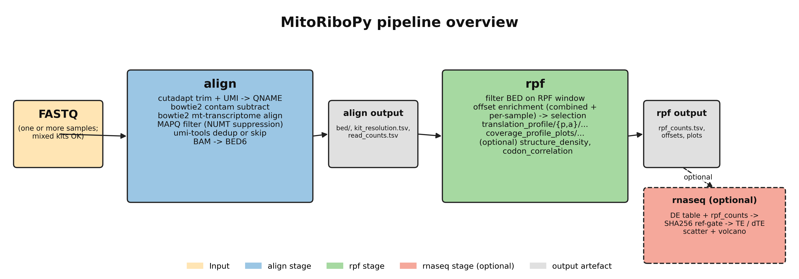

# MitoRiboPy

Mitochondrial ribosome profiling (mt-Ribo-seq) analysis, end to end.

MitoRiboPy is a Python package + CLI for analysing mt-Ribo-seq data from raw FASTQ all the way through translation-efficiency integration with paired RNA-seq. Every per-sample decision (kit, dedup, offsets) is independent, so mixed-library batches just work.

The package is built around four subcommands:

| Subcommand | What it does |
|---|---|
| `mitoribopy align` | FASTQ → BAM → BED6 + per-sample read counts (cutadapt + bowtie2 + umi_tools + pysam) |
| `mitoribopy rpf` | BED/BAM → offsets, translation profile, codon usage, coverage plots |
| `mitoribopy rnaseq` | DE table (DESeq2 / Xtail / Anota2Seq) + rpf outputs → TE and ΔTE tables + plots, with a SHA256 reference-consistency gate |
| `mitoribopy all` | End-to-end orchestrator that runs align + rpf + (optional) rnaseq from one YAML config and writes a composed `run_manifest.json` |

---

## Table of contents

1. [What MitoRiboPy is for](#what-mitoribopy-is-for)
2. [Pipeline overview](#pipeline-overview)
3. [Installation](#installation)
4. [Quick start](#quick-start)
5. [Input files](#input-files)
6. [How to run — YAML vs shell wrapper](#how-to-run--yaml-vs-shell-wrapper)
7. [Strain presets and footprint classes](#strain-presets-and-footprint-classes)
8. [Subcommand reference](#subcommand-reference)
   - [`mitoribopy align`](#mitoribopy-align)
   - [`mitoribopy rpf`](#mitoribopy-rpf)
   - [`mitoribopy rnaseq`](#mitoribopy-rnaseq)
   - [`mitoribopy all`](#mitoribopy-all)
9. [Output overview](#output-overview)
10. [Custom organisms](#custom-organisms)
11. [Built-in references](#built-in-references)
12. [Examples](#examples)
13. [Tools](#tools)
14. [Logs and provenance](#logs-and-provenance)
15. [Development](#development)
16. [License](#license)

---

## What MitoRiboPy is for

MitoRiboPy is a focused tool for the 13 mt-mRNAs of human mitochondria (or 8 mt-mRNAs in yeast, with configurable codon tables for any other mitochondrion). It ships:

- **Per-sample adapter detection** with auto-fallback to the right kit. Mixed-kit and mixed-UMI batches resolve each sample independently. Pre-trimmed FASTQs (e.g. SRA-deposited data) are auto-detected and routed through cutadapt with no `-a` flag.
- **Per-sample offset selection** so inter-sample drift in the canonical 12–15 nt 5' P-site offset doesn't bias your downstream codon-usage tables. A combined-across-samples diagnostic is still emitted and an `offset_drift_<align>.svg` plot makes drift visible at a glance.
- **Both P-site and A-site downstream outputs** by default, side by side under per-site subdirectories. No ambiguity about which output corresponds to which site.
- **Strict reference-consistency gate** for the optional translation-efficiency (TE / ΔTE) integration with paired RNA-seq: Ribo-seq and RNA-seq must hash to the identical transcript reference or the run aborts.
- **Strain-aware defaults**: built-in human (`-s h.sapiens`) and yeast (`-s s.cerevisiae`) annotations + codon tables, plus `custom` for any other organism with a published NCBI Genetic Code (mouse, fly, plants, fungi, ...).

What MitoRiboPy is **not**:

- Not a general-purpose nuclear Ribo-seq pipeline. The defaults, references, and dedup heuristics are calibrated for the low-complexity 13-mRNA mt universe.
- Not a DE engine. RNA-seq DE (DESeq2 / Xtail / Anota2Seq) is run externally on the full transcriptome; MitoRiboPy consumes the resulting table and does TE / ΔTE on the mt-mRNA subset.

---

## Pipeline overview



UMI handling: the UMI is extracted into the read QNAME during the cutadapt trim step (5' single-pass or 3' two-pass), so it travels through bowtie2 alignment unchanged and is available for `umi_tools dedup` after the MAPQ filter — the only stage that needs alignment coordinates AND the UMI together.

### Detailed stage diagrams

- [docs/diagrams/02_align_stage.png](docs/diagrams/02_align_stage.png) — internals of `mitoribopy align`: per-sample resolution → cutadapt + UMI → contam subtract → bowtie2 → MAPQ → dedup → BED6.
- [docs/diagrams/03_rpf_stage.png](docs/diagrams/03_rpf_stage.png) — internals of `mitoribopy rpf`: filter BED → offset enrichment + selection → translation_profile + coverage_profile_plots + optional modules.
- [docs/diagrams/04_rnaseq_stage.png](docs/diagrams/04_rnaseq_stage.png) — internals of the optional `mitoribopy rnaseq` stage: DE table + rpf_counts → SHA256 reference gate → TE → ΔTE → scatter + volcano.

Regenerate with `python docs/diagrams/render_diagrams.py` (matplotlib only; no Node / mermaid-cli required).

---

## Installation

### From PyPI (recommended)

```bash
python -m pip install mitoribopy
```

The package is published on PyPI: [pypi.org/project/mitoribopy](https://pypi.org/project/mitoribopy/). This pulls in every Python dependency (`numpy`, `pandas`, `matplotlib`, `seaborn`, `biopython`, `scipy`, `PyYAML`, `pysam`) automatically. The external bioinformatics tools (`cutadapt`, `bowtie2`, `umi_tools`, …) still need to be on `$PATH` separately — see [External tool dependencies](#external-tool-dependencies) below.

### From source (latest development version)

```bash
git clone https://github.com/Ahram-Ahn/MitoRiboPy.git
cd MitoRiboPy
python -m pip install -e .
```

Use this when you need a fix or feature that has not yet been released to PyPI. For development and tests, install the dev extras:

```bash
python -m pip install -e ".[dev]"
```

### Verify the install

```bash
mitoribopy --version
mitoribopy --help
```

If you prefer not to install at all:

```bash
PYTHONPATH=src python -m mitoribopy --help
```

### External tool dependencies

MitoRiboPy shells out to a small set of standard bioinformatics tools. All of them must be on `$PATH` for a real run:

| Tool | Used by | Required when |
|---|---|---|
| `cutadapt` | `align` | always (length + quality filter even for pre-trimmed data) |
| `bowtie2` + `bowtie2-build` | `align` | always |
| `umi_tools` | `align` | at least one sample's resolved kit has UMIs |
| `pysam` (Python lib) | `align`, `rpf` | always (installed automatically via `pip`) |
| `samtools` | optional | recommended for inspecting outputs; not required |

The bioconda environment under [docs/environment/environment.yml](docs/environment/environment.yml) installs everything in one command:

```bash
conda env create -f docs/environment/environment.yml
conda activate mitoribopy
```

---

## Quick start

The shortest path from raw FASTQ to translation-profile + coverage outputs is one YAML file plus one command.

```bash
# 1. Start from one of two templates next to your data and fill in the paths:
#    -- examples/templates/ ships an EXHAUSTIVE template that lists every
#       available flag with its default value and a 1-line comment:
cp examples/templates/pipeline_config.example.yaml pipeline_config.yaml
#    -- OR get the curated MINIMAL template from the CLI:
mitoribopy all --print-config-template > pipeline_config.yaml

$EDITOR pipeline_config.yaml

# 2. Optional: dry-run prints the per-stage argv so you can review.
mitoribopy all --config pipeline_config.yaml --output results/ --dry-run

# 3. Run.
mitoribopy all --config pipeline_config.yaml --output results/
```

The matching shell-script templates are at [examples/templates/run_align.example.sh](examples/templates/run_align.example.sh), [examples/templates/run_rpf.example.sh](examples/templates/run_rpf.example.sh), and [examples/templates/run_pipeline.example.sh](examples/templates/run_pipeline.example.sh) — pick those if you prefer per-stage commands you can split across cluster jobs.

A minimal `pipeline_config.yaml` for a typical human mt-Ribo-seq run looks like this (annotated):

```yaml
align:
  # Per-sample auto detection; explicit kit_preset becomes a fallback.
  kit_preset: auto                # auto | illumina_smallrna | illumina_truseq |
                                  # illumina_truseq_umi | qiaseq_mirna |
                                  # pretrimmed | custom
  adapter_detection: auto         # auto | off | strict
  library_strandedness: forward
  # Pass a directory string (auto-glob of *.fq, *.fq.gz, *.fastq, *.fastq.gz)
  # OR an explicit list of paths.
  fastq: input_data/seq
  contam_index: input_data/indexes/rrna_contam
  mt_index: input_data/indexes/mt_tx
  mapq: 10
  min_length: 15
  max_length: 45
  dedup_strategy: auto            # umi-tools per sample if UMI, else skip

rpf:
  strain: h.sapiens               # human mt-mRNA reference + codon table
  fasta: input_data/human-mt-mRNA.fasta
  footprint_class: monosome       # short | monosome | disome | custom
  rpf: [29, 34]                   # filtered RPF length range
  align: stop                     # anchor offsets at the stop codon
  offset_type: "5"                # offsets reported from the read 5' end
  offset_site: p                  # selection coordinate space (P-site)
  offset_pick_reference: p_site
  offset_mode: per_sample         # per-sample offsets drive downstream
  analysis_sites: both            # write BOTH P-site and A-site outputs
  min_5_offset: 10
  max_5_offset: 22
  min_3_offset: 10
  max_3_offset: 22
  offset_mask_nt: 5
  plot_format: svg
  codon_density_window: true
```

After the run, you'll have:

```text
results/
  align/    bed/, kit_resolution.tsv, read_counts.tsv, run_settings.json
            (intermediate trimmed/contam_filtered/aligned files are deleted as
             soon as they are consumed; pass --keep-intermediates to retain
             them; deduped/ is only created for UMI samples)
  rpf/      offset_diagnostics/{csv,plots}/, translation_profile/<sample>/...,
            coverage_profile_plots/{read_coverage_*, {p_site,a_site}_density_*},
            codon_correlation/{p_site,a_site}/, igv_tracks/<sample>/, rpf_counts.tsv
  run_manifest.json
```

See [Output overview](#output-overview) for the full directory tree.

---

## Input files

### FASTQ (primary input to `align`)

Accepted file extensions: `*.fq`, `*.fq.gz`, `*.fastq`, `*.fastq.gz`. Both gzipped and uncompressed are auto-detected.

Two ways to point the pipeline at your FASTQs:

1. **Directory** (recommended): pass a directory containing every input FASTQ.
   - CLI: `--fastq-dir input_data/`
   - YAML: `align.fastq: input_data/` (a single string is treated as a directory)
2. **Explicit list**: name each FASTQ.
   - CLI: `--fastq sampleA.fq.gz --fastq sampleB.fq.gz` (repeatable)
   - YAML: `align.fastq: [sampleA.fq.gz, sampleB.fq.gz]` (a list is treated as explicit paths)

Sample names are derived from the FASTQ filename with the extension stripped (`WT_R1.fq.gz` → `WT_R1`). The same name flows through every per-sample table (`read_counts.tsv`, `kit_resolution.tsv`, downstream profile and codon usage subdirs).

### BED (input to `rpf` if you already have aligned BEDs)

Expected columns:

1. `chrom`
2. `start`
3. `end`

Additional BED columns are tolerated. Coordinates are 0-based, end-exclusive intervals (standard BED).

When the `align` stage runs first (or you use `mitoribopy all`), `mitoribopy rpf` consumes `<align>/bed/` automatically — you never need to handle BED files by hand.

### BAM (alternative input to `rpf`)

`mitoribopy rpf --directory <dir>` accepts BAM files mixed with BED. BAMs are auto-converted to BED6 under `<output>/bam_converted/` via pysam. The `--bam_mapq` flag (default 10) filters BAM reads on MAPQ before conversion to suppress NUMT cross-talk; set to 0 to disable.

### Reference FASTA

One FASTA record per mt-mRNA. Headers must match the `sequence_name` column of the annotation CSV (or any of its `sequence_aliases`). The built-in human and yeast annotations cover the canonical mt-mRNAs and ship under `src/mitoribopy/data/`.

For total-genome FASTAs (rare in mt-Ribo-seq), use `--annotation_file` to map FASTA records onto your own annotation rows.

### Annotation CSV (custom organisms)

Built-in `h.sapiens` and `s.cerevisiae` ship complete annotation tables and need nothing here. For any other organism, supply a per-transcript CSV via `--annotation_file`. The full schema (required vs optional columns, defaults, and a worked example) lives in [Custom organisms](#custom-organisms).

### Codon-table JSON (custom organisms)

The 27 NCBI Genetic Codes are bundled. Pick one with `--codon_table_name` (full picker in [Custom organisms](#custom-organisms)). Supply your own `--codon_tables_file` only when your organism's code is not in the NCBI list.

### Read-count table (optional, for RPM normalization)

`.csv`, `.tsv`, and `.txt` accepted; delimiter is auto-detected. Column matching is flexible and case-insensitive, with positional fallback:

- column 1: sample name
- column 2: reference (used when `--rpm_norm_mode mt_mrna`)
- column 3: read count

When `mitoribopy all` runs `align` first, the read-count table is auto-wired from `<run_root>/align/read_counts.tsv`.

---

## How to run — YAML vs shell wrapper

### Recommended: YAML config

```bash
mitoribopy all --config pipeline_config.yaml --output results/ --threads 8
```

This is the canonical invocation. The YAML is self-documenting, version-controllable, and loads exactly the same way the CLI reads it programmatically.

For multi-sample batches, add `max_parallel_samples: N` under the `align:` section of your YAML to align samples concurrently — `--threads` is auto-divided across workers so total CPU use stays ≈ `--threads`. (`mitoribopy all` does not take `--max-parallel-samples` directly at the CLI; the flag is read from the YAML and forwarded to the align stage. The standalone `mitoribopy align` subcommand does accept it on the CLI — see [Example B](#b-just-the-align-stage-on-a-directory-of-fastqs) below.) The joint `rpf` stage stays serial (offset selection is a pooled-across-samples computation). See [Execution / concurrency](#execution--concurrency) under the `mitoribopy align` reference.

### Alternative: bash wrapper for batch / cluster jobs

When every flag should be visible in the job script (e.g. for a cluster scheduler that captures stdout/stderr per task), wrap the YAML invocation in a thin shell wrapper:

```bash
#!/usr/bin/env bash
set -uo pipefail

ENV_BIN=/path/to/conda/envs/mitoribopy/bin
export PATH="$ENV_BIN:$PATH"

ROOT=/path/to/project
cd "$ROOT"

OUT=results/full_run
mkdir -p "$OUT"

mitoribopy all \
  --config pipeline_config.yaml \
  --output "$OUT" \
  --threads 8
RC=$?

echo
echo "================ kit_resolution.tsv ================"
cat "$OUT/align/kit_resolution.tsv"
echo
echo "================ read_counts.tsv ================"
cat "$OUT/align/read_counts.tsv"

echo "$RC" > "$OUT.exitcode"
exit $RC
```

### Direct subcommand invocation

You can run any single stage directly without going through `mitoribopy all`. This is useful when you only have BED inputs (skip `align`), or when you want to iterate on `rpf` parameters without re-running alignment.

```bash
# Just align
mitoribopy align --kit-preset auto --fastq-dir fastqs/ \
  --contam-index idx/rrna --mt-index idx/mt --output results/align/

# Just rpf, against an existing BED dir
mitoribopy rpf -s h -f ref.fa --directory bed/ -rpf 29 34 --output results/rpf/

# Just rnaseq, against existing rpf output + a DE table
mitoribopy rnaseq --de-table de.tsv --gene-id-convention hgnc \
  --ribo-dir results/rpf --reference-gtf ref.fa --output results/rnaseq/
```

---

## Strain presets and footprint classes

### Strain (`-s` / `--strain`)

The strain preset selects the organism's mitochondrial annotation and codon table. Two organisms ship complete reference data; everything else uses `custom` and supplies its own files (see [Custom organisms](#custom-organisms)).

| Value | Organism | Codon table | Ships annotation? | Ships `-rpf` default? |
|---|---|---|:-:|:-:|
| `h.sapiens` (default) | *Homo sapiens* mt | `vertebrate_mitochondrial` (NCBI #2) | ✓ | ✓ |
| `s.cerevisiae` | *Saccharomyces cerevisiae* mt | `yeast_mitochondrial` (NCBI #3) | ✓ | ✓ |
| `custom` | Any other organism | user-supplied via `--codon_table_name` (built-in NCBI list) or `--codon_tables_file` | ✗ — pass `--annotation_file` | ✗ — pass `-rpf MIN MAX` |

`h` and `y` are also accepted as short synonyms for `h.sapiens` and `s.cerevisiae`.

### Footprint class (`--footprint_class`)

Pair `-s` with `--footprint_class` to pick sensible RPF and unfiltered-length defaults. An explicit `-rpf MIN MAX` or `--unfiltered_read_length_range MIN MAX` always wins over the footprint-class default. Built-in defaults exist for `h.sapiens` and `s.cerevisiae`; for `--strain custom` you must also pass `-rpf`.

| Value | RPF window default | `--unfiltered_read_length_range` default | Use for |
|---|---|---|---|
| `short` | h.sapiens / s.cerevisiae: 16–24 | 10–30 | Truncated RNase products. Sit just below the canonical monosome window; useful for context-dependent pausing and as a QC indicator of digest aggressiveness. |
| `monosome` (default) | h.sapiens: 28–34, s.cerevisiae: 37–41 | 15–50 | Single-ribosome footprints. The standard mt-Ribo-seq class. |
| `disome` | h.sapiens: 50–70, s.cerevisiae: 60–90 | 40–100 | Collided-ribosome footprints. eIF5A-depletion, queueing, ribosome-stalling studies. |
| `custom` | user must pass `-rpf` | unchanged | Any non-standard footprint class. |

---

## Subcommand reference

Every subcommand inherits these shared options:

| Flag | Default | Description |
|---|---|---|
| `--config PATH` | — | Configuration file (.json, .yaml, .yml, or .toml). CLI flags override values from the file. |
| `--dry-run` | off | Print planned actions and exit 0 without executing. |
| `--threads N` | 1 | Preferred thread count; exports `OMP_NUM_THREADS`, `OPENBLAS_NUM_THREADS`, `MKL_NUM_THREADS`, `MITORIBOPY_THREADS`. When combined with `--max-parallel-samples M` (align only), each parallel worker's external tools see `max(1, N // M)` threads so the total CPU budget stays ≈ N. |
| `--log-level {DEBUG,INFO,WARNING,ERROR}` | `INFO` | Python logging level for console output. |

---

### `mitoribopy align`

Preprocesses FASTQ inputs into BAM + BED6 + per-sample read counts. Pipeline (per sample):

1. Adapter detection (head-of-FASTQ scan)
2. cutadapt trim (kit-aware; optional UMI extraction)
3. bowtie2 contaminant subtraction
4. bowtie2 mt-transcriptome alignment (Path A: per-mRNA FASTA records)
5. MAPQ filter (NUMT suppression)
6. Deduplication (`umi-tools` for UMI samples, `skip` for no-UMI)
7. BAM → BED6 (strand-aware)

#### Inputs

| Flag | Default | Description |
|---|---|---|
| `--fastq-dir DIR` | — | Directory of `*.fq(.gz)` / `*.fastq(.gz)`. |
| `--fastq PATH` | — | Individual FASTQ; repeatable. Pass `--fastq-dir` OR `--fastq` (or both). |
| `--contam-index BT2_PREFIX` | — | bowtie2 index prefix for the contaminant panel (rRNA + tRNA + spike-ins). Build with `bowtie2-build contaminants.fa <prefix>`. **Required** for non-dry-run. |
| `--mt-index BT2_PREFIX` | — | bowtie2 index prefix for the mt-transcriptome (one FASTA record per mt-mRNA). **Required** for non-dry-run. |
| `--output DIR` | — | Output directory. **Required**. |

#### Library prep

| Flag | Default | Description |
|---|---|---|
| `--kit-preset PRESET` | `auto` | Library-prep adapter family. See [Kit presets](#kit-presets) below for the canonical list. |
| `--adapter SEQ` | — | Explicit 3' adapter sequence. **Required** when `--kit-preset custom`; otherwise an optional fallback used only when detection fails. |
| `--umi-length N` | from preset | Override the kit preset's UMI length. |
| `--umi-position {5p,3p}` | from preset | Override the kit preset's UMI position. |
| `--adapter-detection MODE` | `auto` | `auto` (default), `strict`, or `off`. See [Adapter detection](#adapter-detection) below. |
| `--adapter-detect-reads N` | 5000 | FASTQ reads scanned per sample during detection. |
| `--adapter-detect-min-rate FRAC` | 0.30 | Minimum fraction of scanned reads with adapter signal for the kit to be considered detected. |
| `--adapter-detect-min-len N` | 12 | Adapter prefix length used as the search needle (nt). |
| `--adapter-detect-pretrimmed-threshold FRAC` | 0.05 | When EVERY kit's match rate is at or below this, classify as already-trimmed. |
| `--no-pretrimmed-inference` | off | Disable the auto-fallback to `pretrimmed`. With this flag, adapter detection failure with no `--kit-preset` fallback raises an error instead of silently routing to the `pretrimmed` kit. |
| `--library-strandedness {forward,reverse,unstranded}` | `forward` | `forward` enforces bowtie2 `--norc`; `reverse` enforces `--nofw`; `unstranded` leaves bowtie2 permissive. |
| `--min-length NT` | 15 | Minimum read length kept after trimming. |
| `--max-length NT` | 45 | Maximum read length kept after trimming. |
| `--quality Q` | 20 | cutadapt `-q` Phred+33 3' quality trim threshold. |

##### Kit presets

| Preset | 3' adapter | UMI | Covers (representative) |
|---|---|---|---|
| `auto` | per-sample detection | per-sample | default; scans every input FASTQ |
| `pretrimmed` | none | none | Already-trimmed FASTQs (SRA-deposited, prior trim step). cutadapt skips `-a` |
| `custom` | user-supplied via `--adapter` | configurable | anything not in the table |
| `illumina_smallrna` | `TGGAATTCTCGGGTGCCAAGG` | none | Illumina TruSeq Small RNA |
| `illumina_truseq` | `AGATCGGAAGAGCACACGTCTGAACTCCAGTCA` | none | NEBNext Multiplex Small RNA, TruSeq Stranded Total RNA Gold, Takara SMARTer Stranded Total v3 Pico, Bio-Rad SEQuoia Express Standard, … (any Illumina R1 adapter without a UMI) |
| `illumina_truseq_umi` | `AGATCGGAAGAGCACACGTCTGAACTCCAGTCA` | 8 nt 5' | NEBNext Ultra II UMI, Bio-Rad SEQuoia Complete UMI, … |
| `qiaseq_mirna` | `AACTGTAGGCACCATCAAT` | 12 nt 3' | QIAseq miRNA Library Kit |

Vendor-specific kit names (`truseq_smallrna`, `nebnext_smallrna`, `nebnext_ultra_umi`, `truseq_stranded_total`, `smarter_pico_v3`, `sequoia_express`) are also accepted as synonyms for the adapter-family preset they map to.

##### Adapter detection

| Mode | Behaviour |
|---|---|
| `auto` (default) | Scan each FASTQ; pick the matching preset per sample. Samples whose scan fails fall back to the user's `--kit-preset` / `--adapter` if supplied; otherwise fall through to `pretrimmed` when the data shows no adapter signal at all. |
| `strict` | Scan; HARD-FAIL any sample whose scan disagrees with an explicit `--kit-preset` or yields no match. Use for batch / CI runs where silent surprises are unacceptable. |
| `off` | Skip the scan entirely; trust `--kit-preset` / `--adapter` for every sample (requires an explicit non-`auto` preset). |

The per-sample resolution table (sample, detected_kit, applied_kit, match_rate, dedup_strategy, source) is written to `<output>/kit_resolution.tsv` and embedded under `run_settings.json -> per_sample`. The `source` column distinguishes `detected`, `user_fallback`, `inferred_pretrimmed`, `explicit_off`, and `dry_run_*`.

#### Alignment

| Flag | Default | Description |
|---|---|---|
| `--mapq Q` | 10 | MAPQ threshold for the post-alignment filter (NUMT suppression). |
| `--seed N` | 42 | bowtie2 `--seed` value (deterministic output). |

#### Deduplication

| Flag | Default | Description |
|---|---|---|
| `--dedup-strategy {auto,umi-tools,skip}` | `auto` | Per-sample resolved. `auto` → `umi-tools` for UMI samples, `skip` otherwise. When the resolved strategy is `skip`, the orchestrator does **not** write a duplicate `deduped/<sample>.dedup.bam` — the upstream `aligned/<sample>.mapq.bam` is fed straight into BED conversion. The legacy `mark-duplicates` (picard) option was removed in v0.4.5 because coordinate-only dedup destroys codon-occupancy signal on mt-Ribo-seq libraries (see [docs/validation/taco1_ko_regression.md](docs/validation/taco1_ko_regression.md) for the empirical evidence). |
| `--umi-dedup-method {unique,percentile,cluster,adjacency,directional}` | `unique` | umi_tools `--method`. `unique` collapses only on exact coord+UMI match; other methods may over-collapse in low-complexity mt regions. |

#### Execution / concurrency

Per-sample work in `align` (cutadapt → bowtie2 → MAPQ → dedup → BAM→BED) is independent across samples — each sample writes only to its own per-sample paths. `--max-parallel-samples N` runs that work concurrently in a thread pool while the joint `mitoribopy rpf` stage stays serial (offsets are selected across all samples and aggregate `rpf_counts.tsv` requires a single pass).

| Flag | Default | Description |
|---|---|---|
| `--max-parallel-samples N` | `1` | Number of samples to align concurrently. With `--threads T`, each worker's external tools (cutadapt, bowtie2, umi_tools) get `max(1, T // N)` threads, so total CPU use stays ≈ T regardless of N. Default `1` = serial (current behaviour, fully backward-compatible). Resume-cached samples skip the pool entirely. On any per-sample failure the run is fail-fast: pending futures are cancelled and the first exception is re-raised. |

**Sizing guidance.** A reasonable starting point on a workstation or HPC node: pick `T` = total CPU budget (cores you can use), then choose `N` so each worker still gets ≥ 2 threads — i.e. `N ≤ T / 2`. Examples:

| Cores available | Suggested `--threads` | Suggested `--max-parallel-samples` | Per-tool threads |
|---|---|---|---|
| 8 | 8 | 4 | 2 |
| 16 | 16 | 4 | 4 |
| 16 | 16 | 8 | 2 |
| 32 | 32 | 8 | 4 |

I/O-bound stages (FASTQ gzip read, BAM write) can saturate disk bandwidth before they saturate CPU; if your alignment outputs live on slow networked storage, smaller `N` (more threads per worker, fewer concurrent samples) often wins over larger `N`. The joint `rpf` stage is unaffected — it runs in a single process regardless of this flag.

#### Intermediate files

| Flag | Default | Description |
|---|---|---|
| `--keep-intermediates` | off | Keep the per-step intermediate files (`trimmed/<sample>.trimmed.fq.gz`, `contam_filtered/<sample>.nocontam.fq.gz`, `aligned/<sample>.bam` pre-MAPQ). By default these are deleted as soon as the next step has consumed them, since they are large, regenerable, and not consumed by any downstream stage. Pass this flag when debugging a sample or comparing per-step intermediate counts; expect a 2–3× increase in disk footprint per sample. |

---

### `mitoribopy rpf`

Runs the Ribo-seq analysis pipeline against a directory of BED (or BAM) files. Pipeline:

1. Load + filter BED on the RPF length window
2. Compute offset enrichment (combined + per sample)
3. Select offsets per read length (combined + per sample, depending on `--offset_mode`)
4. Render diagnostic plots (heatmaps, line plots, drift plot)
5. Translation profile: A-/P-/E-site footprint density, frame usage, codon usage (per sample, per requested site)
6. Coverage profile plots (per sample, per requested site)
7. Optional modules: structure-density export, codon correlation

Plain `mitoribopy <flags>` (no subcommand) routes to `mitoribopy rpf` and prints a one-line notice; prefer the explicit subcommand form.

#### Core inputs

| Flag | Default | Description |
|---|---|---|
| `-f, --fasta REF_FASTA` | — | Reference FASTA for the transcript/annotation context. **Required**. |
| `-s, --strain {h.sapiens,s.cerevisiae,custom}` | `h.sapiens` | Reference preset; see [Strain presets](#strain-presets-and-footprint-classes). |
| `-d, --directory BED_DIR` | cwd | Directory of `.bed` and/or `.bam` files. BAMs are auto-converted to BED6 via pysam. |
| `--bam_mapq Q` | 10 | MAPQ threshold for BAM inputs before BAM→BED6 conversion. Set 0 to disable. |
| `-rpf MIN_LEN MAX_LEN` | strain/class default | Inclusive read-length filter range, e.g. `-rpf 29 34`. |
| `--footprint_class {monosome,disome,custom}` | `monosome` | Picks `-rpf` and `--unfiltered_read_length_range` defaults. |
| `--annotation_file ANNOTATION.csv` | — | Per-transcript annotation CSV. Required for `--strain custom`; the built-in `h.sapiens` and `s.cerevisiae` tables are used otherwise. See [Custom organisms](#custom-organisms) for the schema. |
| `--codon_tables_file CODON_TABLES.json` | — | Codon-table JSON override. |
| `--codon_table_name TABLE_NAME` | strain default | Codon table to load (built-in or from `--codon_tables_file`). 27 built-in tables ship; run `--help` for the full list. |
| `--start_codons CODON [CODON ...]` | strain default | Allowed start codons. Defaults: `h.sapiens` → `ATG ATA`, `s.cerevisiae` → `ATG`, `custom` → `ATG`. |
| `--atp8_atp6_baseline {ATP6,ATP8}` | `ATP6` | Baseline name for the bicistronic ATP8/ATP6 transcript. Titles remain ATP8/ATP6. |
| `--nd4l_nd4_baseline {ND4,ND4L}` | `ND4` | Baseline name for the bicistronic ND4L/ND4 transcript. Titles remain ND4L/ND4. |

#### Offset enrichment + selection

| Flag | Default | Description |
|---|---|---|
| `-a, --align {start,stop}` | `start` | Anchor offset enrichment around the start or stop codon. |
| `-r, --range NT` | 20 | Plot offsets from -range to +range around the anchor codon. |
| `--min_offset NT` | 11 | Shared minimum absolute offset (used only when end-specific bounds are not provided). |
| `--max_offset NT` | 20 | Shared maximum absolute offset (used only when end-specific bounds are not provided). |
| `--min_5_offset NT`, `--max_5_offset NT` | from `--min_offset` / `--max_offset` | End-specific 5' selection bounds. **Preferred** over the shared bounds. |
| `--min_3_offset NT`, `--max_3_offset NT` | from `--min_offset` / `--max_offset` | End-specific 3' selection bounds. **Preferred**. |
| `--offset_mask_nt NT` | 5 | Mask near-anchor bins from -N..-1 and +1..+N in summaries and plots. |
| `--offset_pick_reference {p_site,reported_site}` | `p_site` | `p_site`: pick in canonical P-site space, then convert to the reported space. `reported_site`: pick directly in the final `--offset_site` space (no P↔A conversion). |
| `--offset_type {5,3}` | `5` | Which read end the offset is measured from. |
| `--offset_site {p,a}` | `p` | Coordinate space for the SELECTED OFFSETS table (the values in `p_site_offsets_<align>.csv`). Does NOT control which downstream outputs are generated; use `--analysis_sites` for that. |
| `--analysis_sites {p,a,both}` | `both` | Which downstream sites to generate. `both` writes parallel P-site and A-site codon usage + coverage plots, side by side under per-site subdirs. `p` or `a` restricts to one site. |
| `--codon_overlap_mode {full,any}` | `full` | How a read counts toward the codon-level enrichment table at the anchor codon. `full` (default, right for ribo-seq): the read must cover ALL 3 nt of the anchor codon. Example with anchor codon at positions 101–103 — a 30-nt read at 100–129 counts (read covers 101, 102, 103); a read at 102–131 does NOT count (does not cover 101). `any`: any 1-nt overlap counts; the same 102–131 read above WOULD count. Use `any` only for very short reads relative to a codon (rare for ribo-seq). |
| `-p, --psite_offset NT` | — | Use one fixed offset for every read length and sample. Bypasses enrichment-based selection. |
| `--offset_mode {per_sample,combined}` | `per_sample` | `per_sample`: each sample uses its own offsets; drift surfaced in `offset_drift_<align>.svg` and audited per sample in `offset_diagnostics/csv/per_sample_offset/<sample>/offset_applied.csv`. `combined`: pool all samples and apply one offset table to every sample (use this when individual samples have very low coverage and the per-sample selection is noisy). |

#### Outputs and plotting

| Flag | Default | Description |
|---|---|---|
| `-o, --output DIR` | `analysis_results` | Base output directory. |
| `--downstream_dir NAME` | `footprint_density` | Per-sample subdirectory name for frame and codon analyses. |
| `--plot_dir NAME` | `offset_diagnostics` | Subdirectory name for offset CSVs and plots. CSVs (offset tables, per-sample offsets, summaries) land under `<plot_dir>/csv/`; PNG/SVG diagnostics under `<plot_dir>/plots/`. Per-sample offsets live at `<plot_dir>/csv/per_sample_offset/<sample>/`. |
| `-fmt, --plot_format {png,pdf,svg}` | `png` | File format for saved plots. SVG recommended for publication-ready vector output. |
| `--x_breaks NT [NT ...]` | — | Optional custom x-axis tick marks for offset line plots. |
| `--line_plot_style {combined,separate}` | `combined` | Draw 5'/3' offsets in one panel or two. |
| `--cap_percentile FRAC` | 0.999 | Upper percentile cap for coverage-style plots. |
| `-m, --codon_density_window` | off | When set, the codon-level density at each codon centre is summed with its ±1 nt neighbours (a 3-nt sliding window) before being written into the codon coverage / usage tables and plots. Smooths short-window noise around the codon centre. |
| `--order_samples NAME [NAME ...]` | — | Optional explicit sample order for plots and aggregated outputs. |

#### Read-count normalization

| Flag | Default | Description |
|---|---|---|
| `--read_counts_file PATH` | `read_counts_summary.txt` | Read-count table for RPM normalization. Auto-wired from `align/read_counts.tsv` when running through `mitoribopy all`. |
| `--read_counts_sample_col NAME` | auto | Sample column override; defaults to case-insensitive name match, then column 1. |
| `--read_counts_reads_col NAME` | auto | Read-count column override; defaults to `reads` / `read_count` / `counts`, then column 3. |
| `--read_counts_reference_col NAME` | auto | Reference column override; needed for `--rpm_norm_mode mt_mrna` if auto-detection fails. |
| `--unfiltered_read_length_range MIN MAX` | `[15, 50]` | Range for the unfiltered QC summary and heatmaps. Broaden for disome studies. |
| `--rpm_norm_mode {total,mt_mrna}` | `total` | RPM denominator: sum all rows or only mt-mRNA rows. |
| `--mt_mrna_substring_patterns PATTERN [PATTERN ...]` | `mt_genome mt-mrna mt_mrna` | When `--rpm_norm_mode mt_mrna` is selected, the RPM denominator uses only rows from the read-count table whose value in the reference column (set via `--read_counts_reference_col`, or auto-detected) contains ANY of these substrings. Example: in a read-count table with rows for `rrna`, `trna`, `mt_mrna_ND1`, and `mt_mrna_COX1`, the default pattern keeps the latter two and drops the (r/t)RNA rows. |

#### Optional modules

| Flag | Default | Description |
|---|---|---|
| `--structure_density` | off | Export log2 and scaled density values from footprint-density tables. |
| `--structure_density_norm_perc FRAC` | 0.99 | Upper percentile used to cap and scale structure-density values. |
| `--cor_plot` | off | Generate publication-quality codon-correlation plots (one per non-base sample). When `--analysis_sites=both`, produces parallel outputs under `<output>/codon_correlation/p_site/` AND `<output>/codon_correlation/a_site/`; with single-site analysis only the matching folder appears. Each figure is rendered as both SVG (vector, for figures) and 300 dpi PNG (for slides), with: identity (y = x) line, OLS regression line, an `r / R² / p / slope / intercept / N` stat box, an Okabe-Ito colour-blind safe palette per Category, and leader-line labels for the 10 codons farthest from the regression line (placed greedily to avoid overlap). When `--cor_plot` is set but skipped (e.g., `--base_sample` missing), the pipeline log explicitly states the reason. |
| `--base_sample NAME` | — | Reference sample for codon-correlation comparisons. Required by `--cor_plot`. Must match an existing sample directory name. |
| `--cor_mask_method {percentile,fixed,none}` | `percentile` | Masking rule for extreme codon-correlation outliers. The masked-version plot drops codons above the threshold so the bulk of the distribution is visible. |
| `--cor_mask_percentile FRAC` | 0.99 | Used when `--cor_mask_method percentile`. |
| `--cor_mask_threshold FLOAT` | — | Used when `--cor_mask_method fixed`. |
| `--read_coverage_raw` / `--no-read_coverage_raw` | on | Toggle the `coverage_profile_plots/read_coverage_raw[_codon]/` folders. Independent of `--read_coverage_rpm`. |
| `--read_coverage_rpm` / `--no-read_coverage_rpm` | on | Toggle the `coverage_profile_plots/read_coverage_rpm[_codon]/` folders. Independent of `--read_coverage_raw`. |
| `--igv_export` / `--no-igv_export` | off | Write per-sample IGV-loadable BedGraph tracks under `<output>/igv_tracks/<sample>/<sample>_{p_site,a_site}.bedgraph`. P-site tracks default to forest green, A-site to dark orange (set via `track color=` header); load alongside the same FASTA the BEDs were aligned to. |

#### Coverage-profile output reference

`coverage_profile_plots/` always contains two kinds of figures (v0.4.4 flat layout):

- **`read_coverage_*`** (top-level, site-independent) — depth across the transcript using the FULL read footprint (broad peak). The same plot regardless of `--analysis_sites`. Variants: `_rpm` (RPM-normalised), `_raw` (raw counts), `_rpm_codon` / `_raw_codon` (codon-binned across the CDS). Each `_rpm` and `_raw` family is independently toggleable via `--read_coverage_rpm` / `--read_coverage_raw`.
- **`{p_site,a_site}_density_*`** (per-site, single-nucleotide P-site or A-site density, sibling of `read_coverage_*`) — narrow peak at the chosen ribosomal site. The legacy nested `p/` / `a/` subfolders are gone; the site is encoded in the filename prefix. Variants:
  - `{p_site,a_site}_density_rpm` / `_density_raw` — full-transcript density.
  - `{p_site,a_site}_density_rpm_codon` / `_density_raw_codon` — same density but binned per CDS codon.
  - `{p_site,a_site}_density_rpm_frame` / `_density_raw_frame` — **frame-coloured CDS-only nt plots**. Bars are coloured by reading frame (0 / 1 / 2 relative to CDS start) using a colour-blind-safe palette. Frame-0 dominance (~70–90% of CDS density on frame 0) is the canonical mt-Ribo-seq QC signature; if frames 1 and 2 are visible, the library has spurious offset selection, mis-trimmed reads, or contamination from non-ribosome-protected RNA.

For the translation-efficiency integration, use the dedicated `mitoribopy rnaseq` subcommand.

#### Synonyms

The following short / legacy spellings are accepted as synonyms for the canonical names. They emit a single `[mitoribopy] DEPRECATED:` line on first use so users know to migrate, then keep working.

| Synonym | Canonical |
|---|---|
| `-s h` / `--strain h` | `-s h.sapiens` |
| `-s y` / `--strain y` | `-s s.cerevisiae` |
| `--merge_density`, YAML `merge_density:` | `--codon_density_window`, YAML `codon_density_window:` |
| `--mrna_ref_patterns`, YAML `mrna_ref_patterns:` | `--mt_mrna_substring_patterns`, YAML `mt_mrna_substring_patterns:` |
| `--offset_pick_reference selected_site` | `--offset_pick_reference reported_site` |

---

### `mitoribopy rnaseq`

Integrates a pre-computed differential-expression table (DESeq2 / Xtail / Anota2Seq) with a prior `mitoribopy rpf` run and emits TE and ΔTE tables plus diagnostic plots. Enforces a SHA256 reference-consistency gate: Ribo-seq and RNA-seq must hash to the identical transcript set.

#### DE table

| Flag | Default | Description |
|---|---|---|
| `--de-table PATH` | — | DE results table (CSV or TSV). **Required**. |
| `--de-format {auto,deseq2,xtail,anota2seq,custom}` | `auto` | DE table format; `auto` detects from column headers. |
| `--de-gene-col NAME` | — | Column name for gene IDs. Used when `--de-format custom`. |
| `--de-log2fc-col NAME` | — | Column name for log2 fold change. |
| `--de-padj-col NAME` | — | Column name for adjusted p-value. |
| `--de-basemean-col NAME` | — | Column name for basemean. |

#### Gene identifiers

| Flag | Default | Description |
|---|---|---|
| `--gene-id-convention {ensembl,refseq,hgnc,mt_prefixed,bare}` | — | **Required, no default**. Mismatched conventions silently produce zero-match runs. Examples: `hgnc` → `MT-ND1`; `bare` → `ND1`; `ensembl` → `ENSG00000198888`; `refseq` → `YP_003024026.1`; `mt_prefixed` → `MT-ND1`. |
| `--organism {h.sapiens,s.cerevisiae}` | `h.sapiens` | Organism for the mt-mRNA registry. Short / spelled-out forms (`h`, `y`, `human`, `yeast`) are accepted as synonyms. |

#### Ribo-seq inputs

| Flag | Default | Description |
|---|---|---|
| `--ribo-dir DIR` | — | Output directory of a prior `mitoribopy rpf` run. Must contain `rpf_counts.tsv` and `run_settings.json` (or `run_manifest.json`) with a recorded `reference_checksum`. |
| `--ribo-counts PATH` | `<ribo-dir>/rpf_counts.tsv` | Explicit path to the per-sample per-gene RPF counts table. |

#### Reference-consistency gate (exactly one)

| Flag | Default | Description |
|---|---|---|
| `--reference-gtf PATH` | — | Reference used by RNA-seq; `mitoribopy rnaseq` hashes this and verifies it matches the hash in the rpf run's manifest. |
| `--reference-checksum SHA256` | — | Precomputed SHA-256, useful when the reference file is not on the rnaseq host. |

#### Conditions (optional, required for replicate-based ΔTE)

| Flag | Default | Description |
|---|---|---|
| `--condition-map PATH` | — | TSV with columns `sample` and `condition` assigning Ribo-seq samples to conditions. |
| `--condition-a NAME` | — | Reference condition. |
| `--condition-b NAME` | — | Comparison condition. |

Without a condition map, `mitoribopy rnaseq` computes a point-estimate ΔTE using only the DE table's mRNA log2FC and emits rows with a `single_replicate_no_statistics` note.

#### Output

| Flag | Default | Description |
|---|---|---|
| `--output DIR` | — | Output directory for `te.tsv`, `delta_te.tsv`, and plots. |

---

### `mitoribopy all`

End-to-end orchestrator: align + rpf + (optional) rnaseq. Reads one YAML/JSON/TOML config and dispatches to the per-stage subcommands; writes a composed `run_manifest.json` covering every parameter, tool version, and reference checksum.

| Flag | Default | Description |
|---|---|---|
| `--config PATH` | — | Configuration file with `align:` / `rpf:` / `rnaseq:` sections. **Required** unless using `--print-config-template` or `--show-stage-help`. |
| `--output DIR` | — | Run root. Each stage writes under `<output>/align/`, `<output>/rpf/`, `<output>/rnaseq/`. |
| `--resume` | off | Skip stages whose sentinel output already exists: `align/read_counts.tsv`, `rpf/rpf_counts.tsv`, `rnaseq/delta_te.tsv`. |
| `--skip-align` | off | Skip the align stage even when an `align:` section exists. |
| `--skip-rpf` | off | Skip the rpf stage. |
| `--skip-rnaseq` | off | Skip the rnaseq stage even when an `rnaseq:` section exists. |
| `--manifest PATH` | `run_manifest.json` | Manifest filename (relative to `--output`). |
| `--show-stage-help STAGE` | — | Print the full help for one stage (`align`, `rpf`, or `rnaseq`) and exit. Useful because `--help` shows only orchestrator flags. |
| `--print-config-template` | — | Print a commented YAML template covering every stage and exit. |

#### Auto-wiring

When `align` and `rpf` both run, `mitoribopy all` auto-wires:

- `rpf.directory` → `<run_root>/align/bed`
- `rpf.read_counts_file` → `<run_root>/align/read_counts.tsv`

When `rpf` and `rnaseq` both run:

- `rnaseq.ribo_dir` → `<run_root>/rpf`

Each stage's own `--output` defaults to `<run_root>/<stage>/`.

#### YAML config shape

Every key under a section maps to that subcommand's CLI flag with hyphens converted to underscores:

- `align:` keys use the **hyphen** flag style (`--kit-preset` → `kit_preset`).
- `rpf:` keys use the **underscore** flag style (`--offset_type` → `offset_type`) because the rpf parser uses underscored flag names directly.
- `rnaseq:` keys use the hyphen style (`--gene-id-convention` → `gene_id_convention`).

The orchestrator handles both styles transparently. Booleans emit the bare flag (`true`) or are omitted entirely (`false`); `null` values are dropped.

---

## Output overview

For a `mitoribopy all` run with the defaults (`--offset_mode per_sample`, `--analysis_sites both`):

```text
<output>/
  run_manifest.json                    # composed provenance: align + rpf + rnaseq settings,
                                       # tool versions, reference_checksum, stages_run
  align/
    mitoribopy.log
    read_counts.tsv                    # per-stage counts (input → trimmed → contam → mt → MAPQ → dedup)
    kit_resolution.tsv                 # per-sample kit + dedup decisions; the provenance spine
    run_settings.json                  # includes per_sample[] block with detected_kit, applied_kit,
                                       # match_rate, dedup_strategy, source per sample
    trimmed/                           # only *.cutadapt.json (per-sample);
                                       # the trimmed *.fq.gz is deleted after
                                       # contam_filter runs unless
                                       # --keep-intermediates is passed
    contam_filtered/                   # empty unless --keep-intermediates
    aligned/                           # *.mapq.bam (kept; pre-mapq *.bam is
                                       # deleted unless --keep-intermediates)
    deduped/                           # only created when at least one sample
                                       # uses umi-tools; for dedup=skip the
                                       # orchestrator wires mapq.bam straight
                                       # into BED conversion so no duplicate
                                       # dedup.bam is written
    bed/                               # *.bed -- strand-aware BED6 inputs to rpf
  rpf/
    mitoribopy.log
    rpf_counts.tsv                     # per-sample per-gene RPF counts; feeds rnaseq
    run_settings.json                  # includes reference_checksum (SHA256 of --fasta)
    offset_diagnostics/                # renamed from plots_and_csv/ in v0.4.4
      csv/                             # all CSV diagnostics live here
        offset_<align>.csv             # COMBINED enrichment summary
        p_site_offsets_<align>.csv     # COMBINED selected offsets
        read_length_summary.csv        # filtered RPF window per sample
        per_sample_offset/             # renamed from per_sample/ in v0.4.4
          <sample>/
            offset_<align>.csv         # per-sample enrichment summary
            p_site_offsets_<align>.csv # per-sample selected offsets
            offset_applied.csv         # exact offsets row applied to <sample>
                                       # (audit so reviewers can verify
                                       # per-sample selection from disk)
      plots/                           # all PNG/SVG diagnostics live here
        offset_drift_<align>.svg       # per-sample 5'/3' offset comparison; read this FIRST
        offset_*.svg                   # heatmaps + line plots
        unfiltered_heatmap_*.svg
        <sample>_read_length_distribution.svg
    translation_profile/               # FLAT layout (v0.4.4): one folder per sample,
      <sample>/                        # site is encoded in filename prefix.
        footprint_density/             # <transcript>_footprint_density.csv (cols:
                                       #   Position, Nucleotide, A_site, P_site)
                                       # + <transcript>_p_site_depth.png and/or
                                       #   <transcript>_a_site_depth.png
        translating_frame/             # p_site_frame_usage_total.csv, p_site_*_by_transcript.csv,
                                       # a_site_frame_usage_total.csv, a_site_*_by_transcript.csv,
                                       # plus matching _plot.png files
        codon_usage/                   # p_site_codon_usage_<transcript>.csv (P-site, stop-masked),
                                       # p_site_codon_usage_total.csv,
                                       # a_site_codon_usage_<transcript>.csv (A-site, no mask),
                                       # a_site_codon_usage_total.csv, plus matching _plot.png files
    coverage_profile_plots/            # FLAT layout (v0.4.4): site is the filename prefix.
      read_coverage_rpm/               # SITE-INDEPENDENT (gated by --read_coverage_rpm)
      read_coverage_raw/               # SITE-INDEPENDENT (gated by --read_coverage_raw)
      read_coverage_rpm_codon/
      read_coverage_raw_codon/
      p_site_density_rpm/              # P-site nt-resolution density (RPM)
      p_site_density_raw/              # P-site nt-resolution density (raw)
      p_site_density_rpm_codon/        # codon-binned across CDS, RPM
      p_site_density_raw_codon/        # codon-binned across CDS, raw
      p_site_density_rpm_frame/        # CDS-only nt plot, frame-coloured (0/1/2 vs CDS start);
                                       # frame-0 dominance is the canonical mt-Ribo-seq QC.
      p_site_density_raw_frame/        # same but raw counts
      a_site_density_*/                # A-site mirror folders (only when analysis_sites in {a,both})
    structure_density/                 # if --structure_density (uses P-site by default)
    codon_correlation/                 # if --cor_plot
      p_site/<base>_vs_<sample>_{all,masked}.{csv,svg,png}    # P-site correlation
      a_site/<base>_vs_<sample>_{all,masked}.{csv,svg,png}    # A-site correlation
    igv_tracks/                        # if --igv_export
      <sample>/
        <sample>_p_site.bedgraph       # P-site footprint density (forest green track)
        <sample>_a_site.bedgraph       # A-site footprint density (dark orange track)
  rnaseq/                              # if rnaseq config supplied
    te.tsv                             # one row per (sample, gene): rpf_count, mrna_abundance, te
    delta_te.tsv                       # one row per gene: mrna_log2fc, rpf_log2fc, delta_te_log2,
                                       # padj, note
    plots/
      mrna_vs_rpf.png                  # four-quadrant log2FC scatter
      delta_te_volcano.png             # ΔTE (log2) vs -log10(padj)
    run_settings.json
```

In v0.4.4 the legacy `p/` / `a/` subfolders under `translation_profile/` and `coverage_profile_plots/` were dropped. The site is encoded in filename prefixes (`p_site_*` / `a_site_*`) so a single per-sample folder hosts both sites without ambiguity, and downstream tooling never has to branch on `--analysis_sites`.

### Key files to look at first

- **`align/kit_resolution.tsv`** — confirm each sample resolved to the right kit and dedup strategy. The `source` column tells you whether it was `detected`, `user_fallback`, `inferred_pretrimmed`, or set explicitly.
- **`align/read_counts.tsv`** — track per-stage drop-off. The invariants `rrna_aligned + post_rrna_filter == post_trim` and `mt_aligned + unaligned_to_mt == post_rrna_filter` must hold; if they don't, something is wrong with alignment.
- **`rpf/offset_diagnostics/plots/offset_drift_<align>.svg`** — per-sample offset comparison. Outliers are visible by eye in seconds.
- **`rpf/offset_diagnostics/plots/offset_<align>.svg`** (heatmap + line plots) — the combined enrichment around the anchor codon. A sharp peak at the canonical P-site offset (~12–15 nt from the 5' end for most mt-Ribo-seq libraries) confirms library quality.
- **`rpf/offset_diagnostics/csv/per_sample_offset/<sample>/offset_applied.csv`** — exact offsets row applied to `<sample>` downstream. New in v0.4.4 so a reviewer can confirm from disk that per-sample offset selection was honoured by the translation-profile and coverage-profile steps.
- **`rpf/translation_profile/<sample>/codon_usage/p_site_codon_usage_total.csv`** — overall P-site codon occupancy. Compare against `a_site_codon_usage_total.csv` (same folder) to see the A-site picture.
- **`rpf/coverage_profile_plots/p_site_density_rpm_frame/<transcript>_*.svg`** — frame-coloured single-nucleotide P-site density across the CDS only. Bars are coloured by reading frame (0 / 1 / 2 relative to CDS start) using a colour-blind safe palette. **Frame-0 dominance is the canonical mt-Ribo-seq QC signature**: a healthy library shows ~70–90% of the CDS density on frame 0 with much smaller frames 1 and 2; flat or jittery frames suggest contamination, poor offset selection, or a low-complexity region. The `p_site_density_raw_frame/` companion has the same plots in raw counts (use this when comparing against published per-codon counts; otherwise prefer the RPM version for cross-sample comparison).
- **`rpf/codon_correlation/{p_site,a_site}/<base>_vs_<other>_*.svg|png`** — publication-quality scatter of codon usage between samples, one folder per requested site (only when `--cor_plot` is set with `--base_sample`). Includes identity (y = x) line, OLS regression, an `r / R² / p / slope / intercept / N` stat box, and leader-line labels for the 10 codons farthest from the regression line.
- **`rpf/igv_tracks/<sample>/<sample>_{p_site,a_site}.bedgraph`** — IGV-loadable footprint density tracks (only when `--igv_export` is set). Open them alongside the FASTA the BEDs were aligned to; P-site is forest green, A-site dark orange.

---

## Custom organisms

To analyse an organism other than human or yeast, run with `--strain custom` and supply three things: a **reference FASTA** of mt-mRNA transcripts, a **per-transcript annotation CSV**, and a **codon-table choice**. Start codons can be left at the `[ATG]` default or overridden with `--start_codons`.

### Picking a codon table

MitoRiboPy bundles every NCBI Genetic Code as a named table. The names match NCBI's organism-group labels; pick the one for your organism's mitochondrial code (or nuclear code for ciliates / *Candida* / similar).

| `--codon_table_name` | NCBI # | Use for |
|---|:---:|---|
| `standard` | 1 | Most plant mitochondria and plastids; many fungal nuclear genomes |
| `vertebrate_mitochondrial` | 2 | Mouse, rat, zebrafish, Xenopus, chicken — any non-human vertebrate mt |
| `yeast_mitochondrial` | 3 | *S. cerevisiae* and close relatives (matches `s.cerevisiae` preset) |
| `mold_mitochondrial` | 4 | *Neurospora*, *Aspergillus*, *Trichoderma*, mycoplasmas |
| `invertebrate_mitochondrial` | 5 | *Drosophila*, mosquito, *C. elegans* and other invertebrates |
| `echinoderm_mitochondrial` | 9 | Sea urchin, starfish |
| `ascidian_mitochondrial` | 13 | Sea squirts (tunicates) |
| `alternative_flatworm_mitochondrial` | 14 | Flatworms |
| `trematode_mitochondrial` | 21 | Trematodes |

Run `mitoribopy rpf --help` to see the full list of all 27 bundled tables (NCBI #1–34, with a few historical numbers omitted by NCBI). Sources: [NCBI Taxonomy Genetic Codes](https://www.ncbi.nlm.nih.gov/Taxonomy/Utils/wprintgc.cgi) — the JSON tables under [`src/mitoribopy/data/codon_tables.json`](src/mitoribopy/data/codon_tables.json) are a faithful transcription of those NCBI tables.

If the table you need isn't in the built-in list (e.g. an unusual reassignment in a non-model organism), pass `--codon_tables_file your_tables.json --codon_table_name your_name` to load your own JSON. Each entry maps the 64 codons to single-letter amino-acid codes (use `*` for stop):

```json
{
  "your_organism_mitochondrial": {
    "TTT": "F", "TTC": "F", "TTA": "L", "TTG": "L",
    "TAA": "*", "TAG": "*", "TGA": "W",
    "...": "..."
  }
}
```

### Annotation CSV format

`--annotation_file` takes a CSV with one row per mt-mRNA transcript. The loader requires four columns and accepts four optional columns; CDS bounds (`start_codon`, `stop_codon`, `l_cds`) are computed from the UTR lengths and do NOT need to be supplied.

| Column | Required? | Type | Meaning |
|---|:---:|---|---|
| `transcript` | yes | string | Display name used in plots and CSVs (e.g. `ND1`, `COX1`). Must be unique per row. |
| `l_tr` | yes | int | Total transcript length in nt (`l_utr5 + l_cds + l_utr3`). |
| `l_utr5` | yes | int | Length of the 5' UTR in nt (0 if none). |
| `l_utr3` | yes | int | Length of the 3' UTR in nt (0 if none). |
| `l_cds` | optional | int | Length of the CDS in nt. Computed as `l_tr − l_utr5 − l_utr3` when omitted. |
| `sequence_name` | optional | string | The exact FASTA header / BED chrom field for this transcript. Defaults to the `transcript` column when blank, but **must match your FASTA header** if those names differ. |
| `display_name` | optional | string | Human-readable label used in plot titles. Defaults to `transcript` when blank. |
| `sequence_aliases` | optional | string | Semicolon-separated list of legacy IDs that should also map to this transcript (e.g. `ATP86;ATP8_6` if older BEDs use those names). Leave blank when there are none. |

Minimal example for a hypothetical 3-transcript mouse mt-mRNA reference:

```csv
transcript,sequence_name,l_tr,l_utr5,l_utr3
ND1,mouse_ND1,957,0,0
COX1,mouse_COX1,1545,0,0
ATP6,mouse_ATP6,681,0,0
```

The `sequence_name` field MUST match the FASTA header you pass to `-f` AND the BED `chrom` field produced by `mitoribopy align` (so the bowtie2 indexes have to be built from the same FASTA). [`examples/custom_reference/annotation_template.csv`](examples/custom_reference/annotation_template.csv) is a complete worked example.

### Putting it together: a mouse run

```bash
# Build the bowtie2 indexes from your mouse mt-mRNA FASTA + an rRNA decoy.
bowtie2-build mouse-mt-mRNA.fasta indexes/mt
bowtie2-build mouse_rrna.fa       indexes/rrna

# Run the full pipeline.
mitoribopy all --config mouse_pipeline.yaml --output mouse_results/
```

```yaml
# mouse_pipeline.yaml
align:
  kit_preset: auto
  fastq: input_data/seq
  contam_index: indexes/rrna
  mt_index: indexes/mt

rpf:
  strain: custom
  fasta: mouse-mt-mRNA.fasta
  annotation_file: mouse_annotation.csv      # CSV described above
  codon_table_name: vertebrate_mitochondrial # NCBI #2
  rpf: [28, 34]                              # mouse mt-monosome window
  align: stop
  offset_type: "5"
  offset_site: p
```

For other organisms the recipe is identical — only the codon table name and the annotation CSV change.

### Bicistronic transcript pairs

The two overlapping mt-mRNA pairs (`ATP8/ATP6` and `ND4L/ND4`) are kept as paired display names in plot titles. Choose which member's coordinates seed the merged sequence with `--atp8_atp6_baseline ATP8|ATP6` and `--nd4l_nd4_baseline ND4L|ND4` (defaults: `ATP6` and `ND4`). Legacy FASTA / BED identifiers `ATP86` and `ND4L4` are also recognised through the built-in alias map.

---

## Built-in references

MitoRiboPy ships packaged reference data for two organisms:

- *Homo sapiens* mt-translation using the `vertebrate_mitochondrial` codon table (`-s h.sapiens`)
- *Saccharomyces cerevisiae* mt-translation using the `yeast_mitochondrial` codon table (`-s s.cerevisiae`)

Built-in annotation tables are stored as CSV and the bundled NCBI Genetic Codes as JSON under [src/mitoribopy/data](src/mitoribopy/data). 27 codon tables are available out of the box; the picker for non-human, non-yeast organisms lives in [Custom organisms](#custom-organisms).

---

## Examples

### A. Single-command end-to-end (recommended)

```bash
mitoribopy all --config pipeline_config.yaml --output results/ --threads 8
```

### B. Just the align stage on a directory of FASTQs

```bash
mitoribopy align \
  --kit-preset auto \
  --library-strandedness forward \
  --fastq-dir input_data/ \
  --contam-index input_data/indexes/rrna_contam \
  --mt-index input_data/indexes/mt_tx \
  --output results/align/ \
  --threads 8
```

For batches with many samples, add `--max-parallel-samples N` to align several samples concurrently. `--threads` is divided across workers, so total CPU use stays ≈ 8 below — `4 workers × 2 threads/tool`:

```bash
mitoribopy align \
  --kit-preset auto \
  --library-strandedness forward \
  --fastq-dir input_data/ \
  --contam-index input_data/indexes/rrna_contam \
  --mt-index input_data/indexes/mt_tx \
  --output results/align/ \
  --threads 8 \
  --max-parallel-samples 4
```

The joint `mitoribopy rpf` stage is unaffected by this flag; offset selection and the aggregated `rpf_counts.tsv` always require a single pass over all samples together. See the [Execution / concurrency](#execution--concurrency) reference for sizing guidance.

### C. Just the rpf stage on existing BEDs (human, monosome)

```bash
mitoribopy rpf \
  -s h.sapiens \
  -f references/human-mt-mRNA.fasta \
  --directory results/align/bed/ \
  -rpf 29 34 \
  --align stop \
  --offset_type 5 \
  --offset_site p \
  --offset_pick_reference p_site \
  --offset_mode per_sample \
  --analysis_sites both \
  --min_5_offset 10 \
  --max_5_offset 22 \
  --min_3_offset 10 \
  --max_3_offset 22 \
  --offset_mask_nt 5 \
  --plot_format svg \
  --read_counts_file results/align/read_counts.tsv \
  --rpm_norm_mode mt_mrna \
  --output results/rpf/ \
  --codon_density_window
```

### D. Disome (collided ribosome) study

```bash
mitoribopy rpf \
  -s h.sapiens \
  -f references/human-mt-mRNA.fasta \
  --directory bed/ \
  --footprint_class disome \
  --output results_disome/
```

`--footprint_class disome` widens `-rpf` to 50–70 nt (h.sapiens) or 60–90 nt (s.cerevisiae) and `--unfiltered_read_length_range` to 40–100 nt automatically. You can still override either with `-rpf` / `--unfiltered_read_length_range`.

### E. Short truncated RNase products

```bash
mitoribopy rpf \
  -s h.sapiens \
  -f references/human-mt-mRNA.fasta \
  --directory bed/ \
  --footprint_class short \
  --output results_short/
```

`--footprint_class short` targets the 16–24 nt RNase truncation tail and widens the unfiltered QC window to 10–30 nt so the entire short tail is visible in the read-length heatmap.

### F. Custom organism (mouse mt example)

```bash
mitoribopy rpf \
  -s custom \
  -f references/mouse-mt-mRNA.fasta \
  --directory bed/ \
  -rpf 28 34 \
  --annotation_file references/mouse_annotation.csv \
  --codon_table_name vertebrate_mitochondrial \
  --output results_mouse/
```

See [Custom organisms](#custom-organisms) for the annotation CSV schema, the codon-table picker for other organisms, and how to supply your own JSON when the organism's code is not in the built-in NCBI list.

### G. RNA-seq integration for translation efficiency

```bash
mitoribopy rnaseq \
  --de-table de.tsv \
  --gene-id-convention hgnc \
  --ribo-dir results/rpf \
  --reference-gtf references/human-mt-mRNA.fasta \
  --condition-map samples.tsv \
  --condition-a control \
  --condition-b knockdown \
  --output results/rnaseq/
```

### H. Resume a partial run

```bash
mitoribopy all --config pipeline_config.yaml --output results/ --resume
```

`--resume` works at two levels:

1. **Stage level.** Each stage is skipped when its final sentinel file already exists: `align/read_counts.tsv`, `rpf/rpf_counts.tsv`, `rnaseq/delta_te.tsv`.
2. **Per-sample inside the align stage.** Every sample that finishes successfully writes a small JSON marker at `<output>/align/.sample_done/<sample>.json` containing its read-count row. On a subsequent `--resume` run (when `read_counts.tsv` is missing because the previous run crashed mid-batch), samples whose marker is present are reloaded from JSON instead of re-run; the markers from completed samples are merged with the freshly-processed ones to produce the aggregated `read_counts.tsv`. This means a 50-sample run that died at sample 30 picks up at sample 31 the next time you pass `--resume`.

The per-sample markers are written atomically (`.tmp` then rename) so a kill mid-write cannot leave a half-flushed file that would silently feed the wrong row into the aggregated table; corrupt or schema-drifted markers are treated as absent and the sample re-runs cleanly.

### I. Pre-trimmed inputs (e.g. SRA-deposited)

The `pretrimmed` preset name describes the **input state** ("the FASTQ has already been adapter-clipped"), not an action this pipeline takes. SRA-deposited FASTQs typically arrive in this state — the adapter and (when present) the UMI are already stripped before upload.

No special configuration is needed — when adapter detection finds 0% across every kit, the resolver falls through to the `pretrimmed` kit automatically and cutadapt skips the `-a` flag (length and quality filtering still run). To opt in explicitly:

```yaml
align:
  kit_preset: pretrimmed
```

To opt out of the auto-inference and force adapter detection failure to raise instead, pass `--no-pretrimmed-inference` (or set `allow_pretrimmed_inference: false` in YAML).

> **Wording note:** `pretrimmed` describes the input. The per-sample read-count column `post_trim` describes the output stage (read count **after** the cutadapt step has run, regardless of whether anything was actually clipped).

### J. Per-sample UMI / kit overrides (mixed-UMI batches)

When samples in the same batch have different UMI lengths or positions (e.g. one library preps with the NEBNext UMI 5' kit, another with QIAseq miRNA 3' UMI, a third already-trimmed from SRA), put a per-sample list under `align.samples:`:

```yaml
align:
  kit_preset: auto                 # global default for samples not listed below
  fastq: input_data/seq            # FASTQ directory
  contam_index: input_data/indexes/rrna_contam
  mt_index: input_data/indexes/mt_tx
  samples:
    - name: sampleA                # FASTQ basename (sampleA.fq.gz -> sampleA)
      kit_preset: illumina_truseq_umi
      umi_length: 8
      umi_position: 5p
    - name: sampleB
      kit_preset: qiaseq_mirna
      umi_length: 12
      umi_position: 3p
    - name: sampleC                # SRA-deposited, already adapter-clipped
      kit_preset: pretrimmed
      umi_length: 0
```

`mitoribopy all` materializes this block as a sidecar file at `<output>/align/sample_overrides.tsv` and passes it to `mitoribopy align` via `--sample-overrides`. Any field left unset in a sample entry falls through to the global default for that field, so a sample can override only its UMI length without restating the rest of the kit. Per-sample overrides are reported in `kit_resolution.tsv` with a `source` column starting with `per_sample_override:` so the provenance file tells the truth.

You can also write the TSV by hand and skip the YAML samples list:

```
sample      kit_preset            adapter  umi_length  umi_position  dedup_strategy
sampleA     illumina_truseq_umi              8           5p
sampleB     qiaseq_mirna                     12          3p
sampleC     pretrimmed                       0
```

then call `mitoribopy align --sample-overrides path/to/overrides.tsv …`.

---

## Tools

Standalone helper scripts under `mitoribopy.tools.*` — useful for shrinking inputs to a quick smoke-test size before a full pipeline run.

### Subsample a BED file

```bash
python -m mitoribopy.tools.subsample \
    --input  results/align/bed/sample.bed \
    --output /tmp/sample_subsampled.bed \
    --n 50000 \
    --seed 42
```

Reservoir-samples `--n` BED rows (Algorithm R, deterministic with `--seed`). Use the subsampled BED as `--directory` input to `mitoribopy rpf` for a fast end-to-end test.

### Subsample a FASTQ file

```bash
python -m mitoribopy.tools.subsample_fastq \
    --input  raw/sample.fastq.gz \
    --output /tmp/sample_subsampled.fastq.gz \
    --n 200000 \
    --seed 42
```

Reservoir-samples `--n` FASTQ records (4 lines each); gzip is auto-detected on either end via the `.gz` suffix. Plain `.fastq` works too. The first record header must start with `@` or the tool fails fast.

---

## Logs and provenance

- **`<output>/<stage>/mitoribopy.log`** — every stage writes a persistent log file alongside the same lines printed to the terminal.
- **Per-stage `run_settings.json`** — every stage writes its own settings JSON (resolved kit, dedup strategy, MAPQ threshold, reference checksum, tool versions, …).
- **`<output>/run_manifest.json`** — `mitoribopy all` composes per-stage settings into a top-level manifest. The `reference_checksum` from the rpf stage is promoted to the top level so a downstream `rnaseq` run can verify it without drilling into the rpf section.
- **`<output>/align/kit_resolution.tsv`** — per-sample kit + dedup decisions.

---

## Development

Run the test suite with:

```bash
PYTHONPATH=src pytest
```

Helpful tools:

```bash
PYTHONPATH=src pytest -k offset           # run a subset by keyword
PYTHONPATH=src pytest -x --tb=short       # stop at first failure, terse traceback
PYTHONPATH=src pytest tests/test_align_sample_resolve.py -v
```

Documentation lives under [docs/](docs/):

- [docs/README.md](docs/README.md) — index
- [docs/reference/cli.md](docs/reference/cli.md) — concise CLI reference
- [docs/tutorials/](docs/tutorials/) — step-by-step worked examples
- [docs/release-notes/](docs/release-notes/) — version-by-version notes
- [docs/validation/](docs/validation/) — biological validation plans
- [docs/environment/](docs/environment/) — bioconda env file + Dockerfile
- [docs/diagrams/](docs/diagrams/) — Mermaid pipeline diagrams

---

## License

MIT. See [LICENSE](LICENSE).
